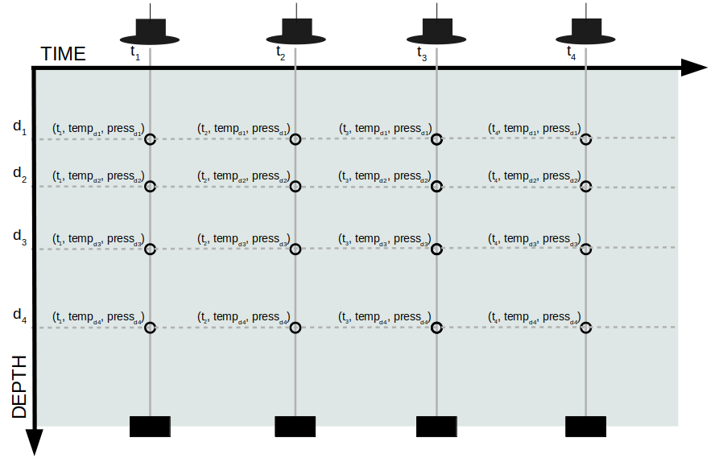
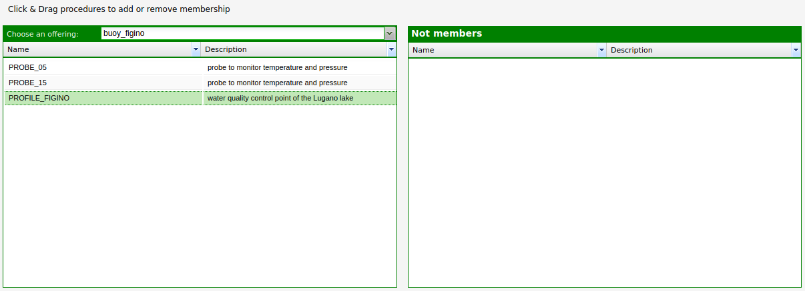

.. profile:

============================
Managing profile procedures
============================

With profile procedures you are able to manage observations coming from a chain of sensors positioned in different depths.

How to register a new profile procedure
=======================================
In this example, we are going to configure a buoy system compose by a chain of two sensors positioned respectively at 5 meter and 15 meter of water depth. Each sensor measures the temperature and the pressure with a frequency of 15 minutes. 

We can use the standard istSOS web administration interface at
http://localhost/istsos/admin/ to start.

Create a new virtual procedure to represent the profile
=======================================================

**1.** First of all we need to know what is the idrometric level of the lake. Since the level of the lake is not constant, we use the idrometric level to have a fixed position of the feature of interest. Such parameter is important because it is used to calculate the depths of the sensors. The idrometric level that we are going to use in this example is: **200 m**. 

**2.** Go to the demo instance and click on the button to *create a new procedure*

.. image:: images/newproc.png

**3.** Fill in the form using the following values to register a virtual procedure that rapresents the profile:

.. code-block:: rest

    Name: PROFILE_FIGINO

    Description: water quality control point of the Lugano lake

    System type: virtual

    Sensor type: buoy monitoring system

    FOI name: FIGINO_200

    EPSG: 4326

    x,y,z: 8.8938, 45.959, 200

.. code-block:: rest

    Observed property: urn:ogc:def:parameter:x-istsos:1.0:water:temperature

    Unit of measure: °C

.. code-block:: rest

    Observed property: urn:ogc:def:parameter:x-istsos:1.0:water:pressure

    Unit of measure: hPa

.. code-block:: rest

    Observed property: urn:ogc:def:parameter:x-istsos:1.0:water:depth

    Unit of measure: m

**3.** Register the new **BUOY_FIGINO** virtual sensor

Finally register the new sensor (procedure) pressing the **"submit"**

Create a procedure for the first sensor (5 m depth)
===================================================

**1.** Go to the demo instance and click on the button to *create a new procedure*

.. image:: images/newproc.png

**2.** Fill in the form using the following values to register an insitu-fixed-point procedure that rapresents the sensor at 5 m depth:

.. code-block:: rest

    Name: PROBE_05

    Description: probe to monitor temperature and pressure

    System type: insitu-fixed-point

    Sensor type: probe

    FOI name: FIGINO_195

    EPSG: 4326

    x,y,z: 8.8938, 45.959, 195

**N.B.: The *z* of the feature of interest correspond to the idrometric level minus the depth at which the sensor is positioned: 200 - 15 = 195**

.. code-block:: rest

    Observed property: urn:ogc:def:parameter:x-istsos:1.0:water:temperature

    Unit of measure: °C

.. code-block:: rest

    Observed property: urn:ogc:def:parameter:x-istsos:1.0:water:pressure

    Unit of measure: hPa

**3.** Register the new **PROBE_05** sensor

Finally register the new sensor (procedure) pressing the **"submit"**

Create a procedure for the second sensor (15 m depth)
=====================================================

**1.** Go to the demo instance and click on the button to *create a new procedure*

.. image:: images/newproc.png

**2.** Fill in the form using the following values to register an insitu-fixed-point procedure that rapresents the sensor at 15 m depth:

.. code-block:: rest

    Name: PROBE_15

    Description: probe to monitor temperature and pressure

    System type: insitu-fixed-point

    Sensor type: probe

    FOI name: FIGINO_185

    EPSG: 4326

    x,y,z: 8.8938, 45.959, 185

**N.B.: The *z* of the feature of interest correspond to the idrometric level minus the depth at which the sensor is positioned: 200 - 15 = 185**

.. code-block:: rest

    Observed property: urn:ogc:def:parameter:x-istsos:1.0:water:temperature

    Unit of measure: °C

.. code-block:: rest

    Observed property: urn:ogc:def:parameter:x-istsos:1.0:water:pressure

    Unit of measure: hPa

**3.** Register the new **PROBE_15** sensor

Finally register the new sensor (procedure) pressing the **"submit"**

Create a new offering
=====================
**1.** Go to the demo instance and click on the button to *offering*

.. image:: images/newoffering.png

**2.** Click on *new* and fill the form using the following values:

.. code-block:: rest

    Name: buoy_figino

**3.** Click on *insert* and you should see the offering *buoy_figino* in the table.

**4.** Click on the tab *Offering-Procedure memberships*

**5.** Select the offering *buoy_figino* on the drop-down list *Choose an offering*

**6.** From the *Not members* section on the right drag and drop on the left section the procedure: PROFILE_FIGINO, PROBE_05 and PROBE_10.

Loading data into procedure PROBE_05 and PROBE_15
=================================================
**1.** To insert some data you need to make an InsertObservation POST request for each procedure PROBE_05 and PROBE_15. Hereinafter the XML body. Pay attention to change the *AssignedSensorId* according to the two procedures (PROBE_05, PROBE_15).

.. code-block:: xml

    <?xml version="1.0" encoding="UTF-8"?>
    <sos:InsertObservation
        xmlns:gml="http://www.opengis.net/gml"
        xmlns:om="http://www.opengis.net/om/1.0"
        xmlns:sos="http://www.opengis.net/sos/1.0"
        xmlns:swe="http://www.opengis.net/swe"
        xmlns:xlink="http://www.w3.org/1999/xlink"
        xmlns:xsi="http://www.w3.org/2001/XMLSchema-instance"
        service="SOS"
        version="1.0.0"
    >
        <sos:AssignedSensorId>933860a66e6911eaaecb04ea56f974eb</sos:AssignedSensorId>
        <om:Observation>
            <om:procedure xlink:href="urn:ogc:def:procedure:x-istsos:1.0:PROBE_15"/>
            <om:samplingTime>
                <gml:TimePeriod>
                    <gml:beginPosition>2020-03-18T00:00:00+00:00</gml:beginPosition>
                    <gml:endPosition>2020-03-25T00:00:00+00:00</gml:endPosition>
                </gml:TimePeriod>
            </om:samplingTime>
            <om:observedProperty>
                <swe:CompositePhenomenon dimension="3">
                    <swe:component xlink:href="urn:ogc:def:parameter:x-istsos:1.0:time:iso8601"/>
                    <swe:component xlink:href="urn:ogc:def:parameter:x-istsos:1.0:water:temperature"/>
                    <swe:component xlink:href="urn:ogc:def:parameter:x-istsos:1.0:water:pressure"/>
                </swe:CompositePhenomenon>
            </om:observedProperty>
            <om:featureOfInterest xlink:href="urn:ogc:def:feature:x-istsos:1.0:Point:FIGINO_185"/>
            <om:result>
                <swe:DataArray>
                    <swe:elementCount>
                        <swe:value>3</swe:value>
                    </swe:elementCount>
                    <swe:elementType name="SimpleDataArray">
                        <swe:DataRecord definition="urn:ogc:def:dataType:x-istsos:1.0:timeSeries">
                            <swe:field name="Time">
                                <swe:Time definition="urn:ogc:def:parameter:x-istsos:1.0:time:iso8601"/>
                            </swe:field>
                            <swe:field name="water-temperature">
                                <swe:Quantity definition="urn:ogc:def:parameter:x-istsos:1.0:water:temperature">
                                    <swe:uom code="°C"/>
                                </swe:Quantity>
                            </swe:field>
                            <swe:field name="water-pressure">
                                <swe:Quantity definition="urn:ogc:def:parameter:x-istsos:1.0:water:pressure">
                                    <swe:uom code="hPa"/>
                                </swe:Quantity>
                            </swe:field>
                        </swe:DataRecord>
                    </swe:elementType>
                    <swe:encoding>
                        <swe:TextBlock blockSeparator="@" decimalSeparator="." tokenSeparator=","/>
                    </swe:encoding>
                    <swe:values>
                        2020-03-18T00:00:00+00:00,26.18,955.14@2020-03-18T00:10:00+00:00,14.83,1090.36@2020-03-18T00:20:00+00:00,32.96,1099.31@2020-03-18T00:30:00+00:00,15.79,1087.78@2020-03-18T00:40:00+00:00,28.45,1044.94@2020-03-18T00:50:00+00:00,23.56,1069.12@2020-03-18T01:00:00+00:00,29.1,1000.6@2020-03-18T01:10:00+00:00,10.16,1086.73@2020-03-18T01:20:00+00:00,24.66,976.59@2020-03-18T01:30:00+00:00,19.67,1009.99@2020-03-18T01:40:00+00:00,25.03,980.7@2020-03-18T01:50:00+00:00,18.11,953.3@2020-03-18T02:00:00+00:00,35.04,1045.58@2020-03-18T02:10:00+00:00,20.59,1076.25@2020-03-18T02:20:00+00:00,17.61,1062.4@2020-03-18T02:30:00+00:00,26.08,1051.95@2020-03-18T02:40:00+00:00,15.94,1099.17@2020-03-18T02:50:00+00:00,15.32,950.92@2020-03-18T03:00:00+00:00,17.14,1031.49@2020-03-18T03:10:00+00:00,25.17,1049.09@2020-03-18T03:20:00+00:00,14.6,977.49@2020-03-18T03:30:00+00:00,15.43,961.39@2020-03-18T03:40:00+00:00,15.31,973.43@2020-03-18T03:50:00+00:00,22.72,1047.84@2020-03-18T04:00:00+00:00,32.25,1090.51@2020-03-18T04:10:00+00:00,36.12,1056.84@2020-03-18T04:20:00+00:00,11.6,1036.42@2020-03-18T04:30:00+00:00,27.51,946.73@2020-03-18T04:40:00+00:00,26.84,902.37@2020-03-18T04:50:00+00:00,18.66,976.15@2020-03-18T05:00:00+00:00,30.77,941.93@2020-03-18T05:10:00+00:00,22.51,973.52@2020-03-18T05:20:00+00:00,35.68,950.46@2020-03-18T05:30:00+00:00,36.56,975.94@2020-03-18T05:40:00+00:00,10.08,1034.74@2020-03-18T05:50:00+00:00,19.15,1056.95@2020-03-18T06:00:00+00:00,11.41,934.05@2020-03-18T06:10:00+00:00,29.31,1029.29@2020-03-18T06:20:00+00:00,23.96,1043.03@2020-03-18T06:30:00+00:00,20.48,990.71@2020-03-18T06:40:00+00:00,10.07,1023.0@2020-03-18T06:50:00+00:00,35.48,1041.57@2020-03-18T07:00:00+00:00,14.51,966.29@2020-03-18T07:10:00+00:00,13.47,917.08@2020-03-18T07:20:00+00:00,31.52,1035.53@2020-03-18T07:30:00+00:00,40.0,1073.65@2020-03-18T07:40:00+00:00,14.24,1021.65@2020-03-18T07:50:00+00:00,16.77,925.94@2020-03-18T08:00:00+00:00,25.25,1054.99@2020-03-18T08:10:00+00:00,38.24,922.09@2020-03-18T08:20:00+00:00,34.43,1078.91@2020-03-18T08:30:00+00:00,21.82,930.27@2020-03-18T08:40:00+00:00,21.33,1004.28@2020-03-18T08:50:00+00:00,31.92,1034.03@2020-03-18T09:00:00+00:00,28.11,1012.13@2020-03-18T09:10:00+00:00,24.66,1085.14@2020-03-18T09:20:00+00:00,32.48,977.74@2020-03-18T09:30:00+00:00,12.46,920.72@2020-03-18T09:40:00+00:00,33.61,919.73@2020-03-18T09:50:00+00:00,36.44,1095.81@2020-03-18T10:00:00+00:00,24.65,1022.41@2020-03-18T10:10:00+00:00,25.17,926.33@2020-03-18T10:20:00+00:00,26.4,952.28@2020-03-18T10:30:00+00:00,10.29,1067.34@2020-03-18T10:40:00+00:00,11.7,1051.94@2020-03-18T10:50:00+00:00,31.63,1058.84@2020-03-18T11:00:00+00:00,11.73,956.32@2020-03-18T11:10:00+00:00,15.99,934.92@2020-03-18T11:20:00+00:00,18.03,952.85@2020-03-18T11:30:00+00:00,24.62,1042.86@2020-03-18T11:40:00+00:00,19.7,954.24@2020-03-18T11:50:00+00:00,25.94,1049.68@2020-03-18T12:00:00+00:00,18.57,1025.32@2020-03-18T12:10:00+00:00,29.39,1006.3@2020-03-18T12:20:00+00:00,21.9,1060.05@2020-03-18T12:30:00+00:00,38.16,1008.36@2020-03-18T12:40:00+00:00,17.34,960.49@2020-03-18T12:50:00+00:00,33.1,1068.46@2020-03-18T13:00:00+00:00,11.71,988.18@2020-03-18T13:10:00+00:00,24.78,1092.13@2020-03-18T13:20:00+00:00,26.26,1056.41@2020-03-18T13:30:00+00:00,23.57,1069.12@2020-03-18T13:40:00+00:00,20.33,1033.87@2020-03-18T13:50:00+00:00,24.3,1036.87@2020-03-18T14:00:00+00:00,13.38,909.69@2020-03-18T14:10:00+00:00,26.37,946.26@2020-03-18T14:20:00+00:00,23.32,1066.81@2020-03-18T14:30:00+00:00,34.39,992.48@2020-03-18T14:40:00+00:00,36.35,1083.29@2020-03-18T14:50:00+00:00,16.08,1039.82@2020-03-18T15:00:00+00:00,32.39,1077.93@2020-03-18T15:10:00+00:00,21.64,1094.86@2020-03-18T15:20:00+00:00,21.15,953.43@2020-03-18T15:30:00+00:00,15.96,997.85@2020-03-18T15:40:00+00:00,17.29,966.04@2020-03-18T15:50:00+00:00,16.82,918.19@2020-03-18T16:00:00+00:00,38.19,1059.69@2020-03-18T16:10:00+00:00,32.12,1010.9@2020-03-18T16:20:00+00:00,15.56,905.51@2020-03-18T16:30:00+00:00,15.75,1008.88@2020-03-18T16:40:00+00:00,15.74,1071.83@2020-03-18T16:50:00+00:00,33.99,985.41@2020-03-18T17:00:00+00:00,15.3,900.88@2020-03-18T17:10:00+00:00,22.97,992.13@2020-03-18T17:20:00+00:00,31.43,1022.0@2020-03-18T17:30:00+00:00,15.28,1082.37@2020-03-18T17:40:00+00:00,26.28,964.33@2020-03-18T17:50:00+00:00,36.73,1052.92@2020-03-18T18:00:00+00:00,33.68,1025.33@2020-03-18T18:10:00+00:00,34.04,1090.75@2020-03-18T18:20:00+00:00,12.48,953.15@2020-03-18T18:30:00+00:00,11.85,1070.68@2020-03-18T18:40:00+00:00,16.28,1006.67@2020-03-18T18:50:00+00:00,13.2,915.73@2020-03-18T19:00:00+00:00,24.46,1058.71@2020-03-18T19:10:00+00:00,20.43,914.85@2020-03-18T19:20:00+00:00,27.3,1013.35@2020-03-18T19:30:00+00:00,24.75,1097.56@2020-03-18T19:40:00+00:00,11.63,973.9@2020-03-18T19:50:00+00:00,24.03,995.97@2020-03-18T20:00:00+00:00,29.3,966.9@2020-03-18T20:10:00+00:00,20.78,1074.55@2020-03-18T20:20:00+00:00,29.93,935.58@2020-03-18T20:30:00+00:00,24.74,920.75@2020-03-18T20:40:00+00:00,31.1,992.48@2020-03-18T20:50:00+00:00,35.29,975.25@2020-03-18T21:00:00+00:00,28.65,1098.82@2020-03-18T21:10:00+00:00,20.76,1056.18@2020-03-18T21:20:00+00:00,31.38,1043.44@2020-03-18T21:30:00+00:00,13.8,994.13@2020-03-18T21:40:00+00:00,23.04,1016.48@2020-03-18T21:50:00+00:00,13.28,1013.93@2020-03-18T22:00:00+00:00,29.34,953.84@2020-03-18T22:10:00+00:00,25.45,969.99@2020-03-18T22:20:00+00:00,35.28,905.3@2020-03-18T22:30:00+00:00,27.94,1016.22@2020-03-18T22:40:00+00:00,12.92,939.45@2020-03-18T22:50:00+00:00,37.0,926.47@2020-03-18T23:00:00+00:00,21.24,929.57@2020-03-18T23:10:00+00:00,16.47,1022.5@2020-03-18T23:20:00+00:00,24.81,1070.23@2020-03-18T23:30:00+00:00,32.96,963.05@2020-03-18T23:40:00+00:00,27.2,1036.05@2020-03-18T23:50:00+00:00,22.02,1075.36@2020-03-19T00:00:00+00:00,24.03,963.74@2020-03-19T00:10:00+00:00,19.91,963.06@2020-03-19T00:20:00+00:00,27.02,980.28@2020-03-19T00:30:00+00:00,39.14,931.33@2020-03-19T00:40:00+00:00,24.18,1037.34@2020-03-19T00:50:00+00:00,24.78,906.7@2020-03-19T01:00:00+00:00,26.69,1031.22@2020-03-19T01:10:00+00:00,26.03,1087.06@2020-03-19T01:20:00+00:00,32.54,927.85@2020-03-19T01:30:00+00:00,23.55,972.46@2020-03-19T01:40:00+00:00,11.97,929.65@2020-03-19T01:50:00+00:00,16.11,1044.81@2020-03-19T02:00:00+00:00,14.46,980.06@2020-03-19T02:10:00+00:00,24.5,974.56@2020-03-19T02:20:00+00:00,34.28,1004.18@2020-03-19T02:30:00+00:00,25.85,900.47@2020-03-19T02:40:00+00:00,17.28,980.73@2020-03-19T02:50:00+00:00,11.02,1006.22@2020-03-19T03:00:00+00:00,28.05,948.42@2020-03-19T03:10:00+00:00,37.18,1018.35@2020-03-19T03:20:00+00:00,18.65,968.23@2020-03-19T03:30:00+00:00,26.05,1071.34@2020-03-19T03:40:00+00:00,18.41,1027.76@2020-03-19T03:50:00+00:00,36.49,953.59@2020-03-19T04:00:00+00:00,35.5,988.77@2020-03-19T04:10:00+00:00,25.06,1064.06@2020-03-19T04:20:00+00:00,32.69,1046.86@2020-03-19T04:30:00+00:00,13.93,938.83@2020-03-19T04:40:00+00:00,13.39,942.53@2020-03-19T04:50:00+00:00,27.11,925.06@2020-03-19T05:00:00+00:00,13.08,1005.64@2020-03-19T05:10:00+00:00,11.31,920.94@2020-03-19T05:20:00+00:00,15.58,1017.53@2020-03-19T05:30:00+00:00,37.1,901.26@2020-03-19T05:40:00+00:00,22.66,965.8@2020-03-19T05:50:00+00:00,21.6,992.66@2020-03-19T06:00:00+00:00,34.79,1073.13@2020-03-19T06:10:00+00:00,30.4,1092.67@2020-03-19T06:20:00+00:00,19.76,1084.48@2020-03-19T06:30:00+00:00,34.09,919.18@2020-03-19T06:40:00+00:00,12.05,953.07@2020-03-19T06:50:00+00:00,35.08,925.93@2020-03-19T07:00:00+00:00,39.87,1022.18@2020-03-19T07:10:00+00:00,30.69,1056.71@2020-03-19T07:20:00+00:00,14.25,1086.42@2020-03-19T07:30:00+00:00,34.19,947.14@2020-03-19T07:40:00+00:00,39.82,970.41@2020-03-19T07:50:00+00:00,24.91,1062.71@2020-03-19T08:00:00+00:00,31.88,1081.89@2020-03-19T08:10:00+00:00,10.83,1019.33@2020-03-19T08:20:00+00:00,21.64,1052.48@2020-03-19T08:30:00+00:00,30.96,1042.29@2020-03-19T08:40:00+00:00,19.41,1041.39@2020-03-19T08:50:00+00:00,17.41,1032.23@2020-03-19T09:00:00+00:00,15.78,975.36@2020-03-19T09:10:00+00:00,29.09,1099.49@2020-03-19T09:20:00+00:00,31.77,984.82@2020-03-19T09:30:00+00:00,13.38,980.78@2020-03-19T09:40:00+00:00,34.66,1000.41@2020-03-19T09:50:00+00:00,32.67,1082.67@2020-03-19T10:00:00+00:00,37.49,1067.57@2020-03-19T10:10:00+00:00,24.26,1042.72@2020-03-19T10:20:00+00:00,13.12,963.08@2020-03-19T10:30:00+00:00,32.19,1050.57@2020-03-19T10:40:00+00:00,29.24,1007.91@2020-03-19T10:50:00+00:00,35.99,1026.27@2020-03-19T11:00:00+00:00,32.85,1005.75@2020-03-19T11:10:00+00:00,18.83,910.45@2020-03-19T11:20:00+00:00,21.54,911.31@2020-03-19T11:30:00+00:00,32.19,978.89@2020-03-19T11:40:00+00:00,20.4,977.71@2020-03-19T11:50:00+00:00,34.44,961.05@2020-03-19T12:00:00+00:00,25.42,950.34@2020-03-19T12:10:00+00:00,25.17,1069.22@2020-03-19T12:20:00+00:00,12.27,925.98@2020-03-19T12:30:00+00:00,27.57,1090.77@2020-03-19T12:40:00+00:00,14.13,985.25@2020-03-19T12:50:00+00:00,23.01,1043.64@2020-03-19T13:00:00+00:00,20.45,1063.74@2020-03-19T13:10:00+00:00,37.27,1032.3@2020-03-19T13:20:00+00:00,16.14,1002.99@2020-03-19T13:30:00+00:00,27.72,1007.85@2020-03-19T13:40:00+00:00,17.77,974.98@2020-03-19T13:50:00+00:00,35.78,987.34@2020-03-19T14:00:00+00:00,15.15,1041.09@2020-03-19T14:10:00+00:00,13.38,952.7@2020-03-19T14:20:00+00:00,15.17,1059.6@2020-03-19T14:30:00+00:00,25.98,1091.55@2020-03-19T14:40:00+00:00,28.43,910.9@2020-03-19T14:50:00+00:00,14.9,1017.6@2020-03-19T15:00:00+00:00,18.33,1067.25@2020-03-19T15:10:00+00:00,10.27,935.32@2020-03-19T15:20:00+00:00,32.05,1026.5@2020-03-19T15:30:00+00:00,22.29,1074.11@2020-03-19T15:40:00+00:00,17.45,963.99@2020-03-19T15:50:00+00:00,18.5,1079.98@2020-03-19T16:00:00+00:00,35.06,904.74@2020-03-19T16:10:00+00:00,22.87,976.48@2020-03-19T16:20:00+00:00,22.43,967.03@2020-03-19T16:30:00+00:00,35.02,945.53@2020-03-19T16:40:00+00:00,13.6,1057.95@2020-03-19T16:50:00+00:00,13.07,1036.55@2020-03-19T17:00:00+00:00,15.36,971.38@2020-03-19T17:10:00+00:00,16.14,986.83@2020-03-19T17:20:00+00:00,14.87,932.97@2020-03-19T17:30:00+00:00,27.18,1030.82@2020-03-19T17:40:00+00:00,29.56,1033.86@2020-03-19T17:50:00+00:00,22.28,951.75@2020-03-19T18:00:00+00:00,26.86,905.13@2020-03-19T18:10:00+00:00,22.26,901.87@2020-03-19T18:20:00+00:00,24.93,1046.45@2020-03-19T18:30:00+00:00,29.74,1043.67@2020-03-19T18:40:00+00:00,25.07,934.05@2020-03-19T18:50:00+00:00,20.2,919.72@2020-03-19T19:00:00+00:00,31.76,1026.77@2020-03-19T19:10:00+00:00,22.45,931.64@2020-03-19T19:20:00+00:00,21.67,1044.87@2020-03-19T19:30:00+00:00,10.43,1010.88@2020-03-19T19:40:00+00:00,39.47,908.61@2020-03-19T19:50:00+00:00,21.15,1062.36@2020-03-19T20:00:00+00:00,13.58,986.31@2020-03-19T20:10:00+00:00,34.94,1053.65@2020-03-19T20:20:00+00:00,30.6,940.98@2020-03-19T20:30:00+00:00,33.88,933.5@2020-03-19T20:40:00+00:00,32.45,1009.43@2020-03-19T20:50:00+00:00,13.05,1000.87@2020-03-19T21:00:00+00:00,32.04,987.13@2020-03-19T21:10:00+00:00,35.44,1001.85@2020-03-19T21:20:00+00:00,11.06,952.9@2020-03-19T21:30:00+00:00,10.26,906.16@2020-03-19T21:40:00+00:00,31.48,966.02@2020-03-19T21:50:00+00:00,15.06,1031.85@2020-03-19T22:00:00+00:00,26.4,902.48@2020-03-19T22:10:00+00:00,22.22,924.86@2020-03-19T22:20:00+00:00,28.22,936.01@2020-03-19T22:30:00+00:00,11.23,922.0@2020-03-19T22:40:00+00:00,18.75,921.6@2020-03-19T22:50:00+00:00,10.75,924.59@2020-03-19T23:00:00+00:00,24.83,995.7@2020-03-19T23:10:00+00:00,13.76,1036.47@2020-03-19T23:20:00+00:00,15.98,928.98@2020-03-19T23:30:00+00:00,15.19,1009.0@2020-03-19T23:40:00+00:00,35.19,1005.72@2020-03-19T23:50:00+00:00,14.37,1018.79@2020-03-20T00:00:00+00:00,15.79,935.72@2020-03-20T00:10:00+00:00,38.09,1082.16@2020-03-20T00:20:00+00:00,34.65,1029.79@2020-03-20T00:30:00+00:00,39.24,1035.77@2020-03-20T00:40:00+00:00,32.09,1046.05@2020-03-20T00:50:00+00:00,38.03,940.43@2020-03-20T01:00:00+00:00,12.88,918.76@2020-03-20T01:10:00+00:00,17.7,1070.36@2020-03-20T01:20:00+00:00,29.35,1059.05@2020-03-20T01:30:00+00:00,34.58,934.02@2020-03-20T01:40:00+00:00,33.01,936.82@2020-03-20T01:50:00+00:00,19.5,922.29@2020-03-20T02:00:00+00:00,38.82,1000.49@2020-03-20T02:10:00+00:00,10.51,918.44@2020-03-20T02:20:00+00:00,10.77,1033.74@2020-03-20T02:30:00+00:00,28.54,1091.96@2020-03-20T02:40:00+00:00,31.64,936.29@2020-03-20T02:50:00+00:00,34.15,1011.42@2020-03-20T03:00:00+00:00,36.19,963.05@2020-03-20T03:10:00+00:00,33.87,999.04@2020-03-20T03:20:00+00:00,35.44,995.04@2020-03-20T03:30:00+00:00,24.22,972.79@2020-03-20T03:40:00+00:00,26.58,970.83@2020-03-20T03:50:00+00:00,39.49,1081.15@2020-03-20T04:00:00+00:00,32.31,954.02@2020-03-20T04:10:00+00:00,14.32,953.42@2020-03-20T04:20:00+00:00,16.07,1007.92@2020-03-20T04:30:00+00:00,33.98,963.65@2020-03-20T04:40:00+00:00,22.59,1015.36@2020-03-20T04:50:00+00:00,32.78,984.44@2020-03-20T05:00:00+00:00,19.11,906.33@2020-03-20T05:10:00+00:00,31.52,911.05@2020-03-20T05:20:00+00:00,19.11,971.78@2020-03-20T05:30:00+00:00,32.79,999.08@2020-03-20T05:40:00+00:00,35.36,957.74@2020-03-20T05:50:00+00:00,14.77,1007.85@2020-03-20T06:00:00+00:00,26.87,1056.44@2020-03-20T06:10:00+00:00,32.97,962.24@2020-03-20T06:20:00+00:00,26.88,1032.7@2020-03-20T06:30:00+00:00,34.95,1017.07@2020-03-20T06:40:00+00:00,16.05,961.49@2020-03-20T06:50:00+00:00,15.01,910.59@2020-03-20T07:00:00+00:00,25.79,948.27@2020-03-20T07:10:00+00:00,26.56,999.09@2020-03-20T07:20:00+00:00,11.28,1033.42@2020-03-20T07:30:00+00:00,19.66,1046.18@2020-03-20T07:40:00+00:00,26.69,966.45@2020-03-20T07:50:00+00:00,22.41,901.79@2020-03-20T08:00:00+00:00,18.35,1072.53@2020-03-20T08:10:00+00:00,35.35,908.98@2020-03-20T08:20:00+00:00,16.97,1099.03@2020-03-20T08:30:00+00:00,13.39,1046.56@2020-03-20T08:40:00+00:00,29.98,1045.34@2020-03-20T08:50:00+00:00,30.04,1014.34@2020-03-20T09:00:00+00:00,25.06,943.12@2020-03-20T09:10:00+00:00,18.2,1002.38@2020-03-20T09:20:00+00:00,26.88,957.36@2020-03-20T09:30:00+00:00,30.88,992.9@2020-03-20T09:40:00+00:00,26.46,917.8@2020-03-20T09:50:00+00:00,22.62,939.81@2020-03-20T10:00:00+00:00,24.12,984.78@2020-03-20T10:10:00+00:00,15.23,1005.12@2020-03-20T10:20:00+00:00,37.91,907.77@2020-03-20T10:30:00+00:00,22.38,968.91@2020-03-20T10:40:00+00:00,28.94,980.56@2020-03-20T10:50:00+00:00,31.6,1033.18@2020-03-20T11:00:00+00:00,29.64,1022.06@2020-03-20T11:10:00+00:00,11.74,929.16@2020-03-20T11:20:00+00:00,18.65,1007.16@2020-03-20T11:30:00+00:00,11.46,996.4@2020-03-20T11:40:00+00:00,17.33,1072.45@2020-03-20T11:50:00+00:00,37.4,949.1@2020-03-20T12:00:00+00:00,32.25,990.93@2020-03-20T12:10:00+00:00,32.92,1019.06@2020-03-20T12:20:00+00:00,22.34,926.22@2020-03-20T12:30:00+00:00,36.45,1010.38@2020-03-20T12:40:00+00:00,39.16,970.08@2020-03-20T12:50:00+00:00,36.97,1052.04@2020-03-20T13:00:00+00:00,33.72,1064.55@2020-03-20T13:10:00+00:00,27.53,947.07@2020-03-20T13:20:00+00:00,31.34,1082.03@2020-03-20T13:30:00+00:00,25.86,1055.66@2020-03-20T13:40:00+00:00,21.13,1097.45@2020-03-20T13:50:00+00:00,29.69,942.63@2020-03-20T14:00:00+00:00,39.75,987.62@2020-03-20T14:10:00+00:00,28.47,1007.33@2020-03-20T14:20:00+00:00,26.77,954.53@2020-03-20T14:30:00+00:00,35.39,1020.05@2020-03-20T14:40:00+00:00,34.94,1056.08@2020-03-20T14:50:00+00:00,16.66,1037.58@2020-03-20T15:00:00+00:00,13.22,1058.34@2020-03-20T15:10:00+00:00,39.02,1031.75@2020-03-20T15:20:00+00:00,23.28,972.25@2020-03-20T15:30:00+00:00,33.18,911.47@2020-03-20T15:40:00+00:00,28.79,956.04@2020-03-20T15:50:00+00:00,26.48,1046.0@2020-03-20T16:00:00+00:00,37.89,1044.47@2020-03-20T16:10:00+00:00,26.76,1068.08@2020-03-20T16:20:00+00:00,25.23,922.03@2020-03-20T16:30:00+00:00,24.54,1080.47@2020-03-20T16:40:00+00:00,11.03,965.01@2020-03-20T16:50:00+00:00,34.19,1080.87@2020-03-20T17:00:00+00:00,34.23,1010.13@2020-03-20T17:10:00+00:00,35.85,1028.17@2020-03-20T17:20:00+00:00,24.08,1094.44@2020-03-20T17:30:00+00:00,17.69,942.02@2020-03-20T17:40:00+00:00,36.3,952.78@2020-03-20T17:50:00+00:00,18.98,920.31@2020-03-20T18:00:00+00:00,23.82,1092.88@2020-03-20T18:10:00+00:00,27.13,1035.88@2020-03-20T18:20:00+00:00,13.12,960.39@2020-03-20T18:30:00+00:00,23.88,1045.98@2020-03-20T18:40:00+00:00,36.07,960.56@2020-03-20T18:50:00+00:00,28.64,1066.57@2020-03-20T19:00:00+00:00,27.65,1093.01@2020-03-20T19:10:00+00:00,13.26,1007.95@2020-03-20T19:20:00+00:00,22.62,950.78@2020-03-20T19:30:00+00:00,15.92,1004.12@2020-03-20T19:40:00+00:00,14.28,928.44@2020-03-20T19:50:00+00:00,31.1,921.92@2020-03-20T20:00:00+00:00,11.09,1002.48@2020-03-20T20:10:00+00:00,30.28,910.78@2020-03-20T20:20:00+00:00,14.8,1078.64@2020-03-20T20:30:00+00:00,34.68,972.63@2020-03-20T20:40:00+00:00,37.97,1018.86@2020-03-20T20:50:00+00:00,40.0,996.3@2020-03-20T21:00:00+00:00,20.94,1029.83@2020-03-20T21:10:00+00:00,32.27,949.11@2020-03-20T21:20:00+00:00,28.38,910.09@2020-03-20T21:30:00+00:00,37.81,990.12@2020-03-20T21:40:00+00:00,13.39,917.87@2020-03-20T21:50:00+00:00,11.44,907.6@2020-03-20T22:00:00+00:00,34.88,961.27@2020-03-20T22:10:00+00:00,30.15,1092.58@2020-03-20T22:20:00+00:00,15.39,1078.71@2020-03-20T22:30:00+00:00,13.56,1053.29@2020-03-20T22:40:00+00:00,11.1,903.12@2020-03-20T22:50:00+00:00,10.17,1018.4@2020-03-20T23:00:00+00:00,15.34,961.73@2020-03-20T23:10:00+00:00,33.56,1042.44@2020-03-20T23:20:00+00:00,13.03,993.57@2020-03-20T23:30:00+00:00,19.2,957.66@2020-03-20T23:40:00+00:00,27.61,1091.2@2020-03-20T23:50:00+00:00,20.87,1015.15@2020-03-21T00:00:00+00:00,19.25,1024.42@2020-03-21T00:10:00+00:00,12.46,1015.58@2020-03-21T00:20:00+00:00,20.45,923.3@2020-03-21T00:30:00+00:00,18.53,1049.03@2020-03-21T00:40:00+00:00,36.85,1085.13@2020-03-21T00:50:00+00:00,33.18,973.01@2020-03-21T01:00:00+00:00,37.64,1042.98@2020-03-21T01:10:00+00:00,35.41,930.55@2020-03-21T01:20:00+00:00,24.37,925.61@2020-03-21T01:30:00+00:00,25.28,1033.43@2020-03-21T01:40:00+00:00,29.98,1020.92@2020-03-21T01:50:00+00:00,16.9,993.82@2020-03-21T02:00:00+00:00,29.91,943.24@2020-03-21T02:10:00+00:00,16.42,1069.09@2020-03-21T02:20:00+00:00,37.46,974.86@2020-03-21T02:30:00+00:00,39.48,982.69@2020-03-21T02:40:00+00:00,35.4,1092.65@2020-03-21T02:50:00+00:00,16.57,1025.59@2020-03-21T03:00:00+00:00,38.91,1069.35@2020-03-21T03:10:00+00:00,33.79,1079.65@2020-03-21T03:20:00+00:00,32.74,1099.69@2020-03-21T03:30:00+00:00,29.53,966.75@2020-03-21T03:40:00+00:00,18.9,965.42@2020-03-21T03:50:00+00:00,18.29,933.04@2020-03-21T04:00:00+00:00,35.67,1042.92@2020-03-21T04:10:00+00:00,31.57,946.1@2020-03-21T04:20:00+00:00,23.06,1016.46@2020-03-21T04:30:00+00:00,15.13,939.49@2020-03-21T04:40:00+00:00,32.4,987.25@2020-03-21T04:50:00+00:00,26.78,1014.4@2020-03-21T05:00:00+00:00,13.1,935.06@2020-03-21T05:10:00+00:00,21.87,976.07@2020-03-21T05:20:00+00:00,29.61,1029.61@2020-03-21T05:30:00+00:00,30.05,911.67@2020-03-21T05:40:00+00:00,38.72,952.48@2020-03-21T05:50:00+00:00,20.74,994.87@2020-03-21T06:00:00+00:00,10.41,1091.58@2020-03-21T06:10:00+00:00,14.11,974.15@2020-03-21T06:20:00+00:00,11.85,1087.14@2020-03-21T06:30:00+00:00,23.42,938.88@2020-03-21T06:40:00+00:00,22.69,939.68@2020-03-21T06:50:00+00:00,31.98,987.47@2020-03-21T07:00:00+00:00,28.7,1067.99@2020-03-21T07:10:00+00:00,35.03,1032.56@2020-03-21T07:20:00+00:00,20.36,973.8@2020-03-21T07:30:00+00:00,14.64,963.88@2020-03-21T07:40:00+00:00,34.28,1058.31@2020-03-21T07:50:00+00:00,22.11,1031.27@2020-03-21T08:00:00+00:00,21.57,905.75@2020-03-21T08:10:00+00:00,34.66,928.39@2020-03-21T08:20:00+00:00,16.09,955.43@2020-03-21T08:30:00+00:00,14.25,1092.52@2020-03-21T08:40:00+00:00,32.28,931.23@2020-03-21T08:50:00+00:00,30.04,1008.29@2020-03-21T09:00:00+00:00,16.62,965.25@2020-03-21T09:10:00+00:00,25.31,971.25@2020-03-21T09:20:00+00:00,17.18,903.64@2020-03-21T09:30:00+00:00,12.12,971.25@2020-03-21T09:40:00+00:00,32.84,991.39@2020-03-21T09:50:00+00:00,13.06,974.86@2020-03-21T10:00:00+00:00,12.73,1071.17@2020-03-21T10:10:00+00:00,16.46,957.23@2020-03-21T10:20:00+00:00,31.19,1020.3@2020-03-21T10:30:00+00:00,33.88,969.52@2020-03-21T10:40:00+00:00,15.26,982.0@2020-03-21T10:50:00+00:00,10.09,982.75@2020-03-21T11:00:00+00:00,25.55,1097.43@2020-03-21T11:10:00+00:00,23.92,991.62@2020-03-21T11:20:00+00:00,28.54,984.37@2020-03-21T11:30:00+00:00,34.14,1084.07@2020-03-21T11:40:00+00:00,17.35,945.36@2020-03-21T11:50:00+00:00,39.83,1016.02@2020-03-21T12:00:00+00:00,26.37,1092.34@2020-03-21T12:10:00+00:00,38.64,1032.23@2020-03-21T12:20:00+00:00,25.33,951.27@2020-03-21T12:30:00+00:00,28.26,944.03@2020-03-21T12:40:00+00:00,29.11,1072.54@2020-03-21T12:50:00+00:00,30.23,966.47@2020-03-21T13:00:00+00:00,37.44,958.42@2020-03-21T13:10:00+00:00,38.11,946.83@2020-03-21T13:20:00+00:00,34.55,908.46@2020-03-21T13:30:00+00:00,12.15,966.05@2020-03-21T13:40:00+00:00,22.83,904.9@2020-03-21T13:50:00+00:00,14.11,927.07@2020-03-21T14:00:00+00:00,32.47,1016.76@2020-03-21T14:10:00+00:00,15.67,987.17@2020-03-21T14:20:00+00:00,27.55,941.97@2020-03-21T14:30:00+00:00,19.64,904.17@2020-03-21T14:40:00+00:00,39.81,1056.0@2020-03-21T14:50:00+00:00,21.25,1028.97@2020-03-21T15:00:00+00:00,33.92,1078.87@2020-03-21T15:10:00+00:00,11.57,1074.73@2020-03-21T15:20:00+00:00,33.56,1012.29@2020-03-21T15:30:00+00:00,37.59,916.18@2020-03-21T15:40:00+00:00,18.08,975.91@2020-03-21T15:50:00+00:00,14.29,1094.71@2020-03-21T16:00:00+00:00,32.67,1082.99@2020-03-21T16:10:00+00:00,34.59,1093.4@2020-03-21T16:20:00+00:00,35.64,955.01@2020-03-21T16:30:00+00:00,10.41,1007.75@2020-03-21T16:40:00+00:00,39.2,1090.79@2020-03-21T16:50:00+00:00,35.61,1030.2@2020-03-21T17:00:00+00:00,32.84,928.71@2020-03-21T17:10:00+00:00,15.51,1066.33@2020-03-21T17:20:00+00:00,14.83,902.22@2020-03-21T17:30:00+00:00,13.3,977.41@2020-03-21T17:40:00+00:00,11.12,963.4@2020-03-21T17:50:00+00:00,22.37,956.78@2020-03-21T18:00:00+00:00,15.45,1074.62@2020-03-21T18:10:00+00:00,20.31,1033.08@2020-03-21T18:20:00+00:00,39.12,905.86@2020-03-21T18:30:00+00:00,17.75,985.24@2020-03-21T18:40:00+00:00,19.19,983.37@2020-03-21T18:50:00+00:00,39.85,918.21@2020-03-21T19:00:00+00:00,26.89,964.83@2020-03-21T19:10:00+00:00,24.94,1082.29@2020-03-21T19:20:00+00:00,27.3,1052.33@2020-03-21T19:30:00+00:00,24.0,1051.26@2020-03-21T19:40:00+00:00,38.05,977.67@2020-03-21T19:50:00+00:00,39.86,964.55@2020-03-21T20:00:00+00:00,12.26,946.35@2020-03-21T20:10:00+00:00,25.78,986.0@2020-03-21T20:20:00+00:00,19.52,1047.05@2020-03-21T20:30:00+00:00,34.87,1045.6@2020-03-21T20:40:00+00:00,25.85,1075.16@2020-03-21T20:50:00+00:00,11.76,1046.09@2020-03-21T21:00:00+00:00,27.28,1076.07@2020-03-21T21:10:00+00:00,17.99,1069.12@2020-03-21T21:20:00+00:00,38.47,1004.69@2020-03-21T21:30:00+00:00,10.34,996.45@2020-03-21T21:40:00+00:00,36.52,1058.35@2020-03-21T21:50:00+00:00,22.94,942.85@2020-03-21T22:00:00+00:00,38.65,980.36@2020-03-21T22:10:00+00:00,11.99,1074.79@2020-03-21T22:20:00+00:00,12.68,1075.49@2020-03-21T22:30:00+00:00,14.75,994.2@2020-03-21T22:40:00+00:00,14.56,916.54@2020-03-21T22:50:00+00:00,21.99,941.73@2020-03-21T23:00:00+00:00,22.71,1030.25@2020-03-21T23:10:00+00:00,27.72,922.17@2020-03-21T23:20:00+00:00,31.4,1001.75@2020-03-21T23:30:00+00:00,15.66,1000.91@2020-03-21T23:40:00+00:00,28.65,961.86@2020-03-21T23:50:00+00:00,38.86,1035.63@2020-03-22T00:00:00+00:00,21.53,1045.61@2020-03-22T00:10:00+00:00,16.29,953.47@2020-03-22T00:20:00+00:00,20.7,1027.78@2020-03-22T00:30:00+00:00,16.03,917.45@2020-03-22T00:40:00+00:00,16.6,984.12@2020-03-22T00:50:00+00:00,36.33,920.4@2020-03-22T01:00:00+00:00,22.4,1063.54@2020-03-22T01:10:00+00:00,23.56,948.35@2020-03-22T01:20:00+00:00,32.89,959.0@2020-03-22T01:30:00+00:00,31.45,1070.69@2020-03-22T01:40:00+00:00,19.3,1037.24@2020-03-22T01:50:00+00:00,25.7,981.24@2020-03-22T02:00:00+00:00,10.01,994.8@2020-03-22T02:10:00+00:00,39.58,963.54@2020-03-22T02:20:00+00:00,19.65,1072.69@2020-03-22T02:30:00+00:00,38.37,1043.12@2020-03-22T02:40:00+00:00,14.48,1070.62@2020-03-22T02:50:00+00:00,24.2,940.87@2020-03-22T03:00:00+00:00,22.13,1017.73@2020-03-22T03:10:00+00:00,17.5,971.55@2020-03-22T03:20:00+00:00,36.65,902.34@2020-03-22T03:30:00+00:00,26.47,975.39@2020-03-22T03:40:00+00:00,31.93,1051.9@2020-03-22T03:50:00+00:00,22.16,1081.94@2020-03-22T04:00:00+00:00,25.29,1004.33@2020-03-22T04:10:00+00:00,24.52,982.29@2020-03-22T04:20:00+00:00,33.75,1047.62@2020-03-22T04:30:00+00:00,32.08,1037.42@2020-03-22T04:40:00+00:00,16.36,1066.0@2020-03-22T04:50:00+00:00,18.18,994.18@2020-03-22T05:00:00+00:00,23.64,950.21@2020-03-22T05:10:00+00:00,36.5,1047.92@2020-03-22T05:20:00+00:00,26.5,911.86@2020-03-22T05:30:00+00:00,15.87,905.25@2020-03-22T05:40:00+00:00,32.98,970.29@2020-03-22T05:50:00+00:00,24.2,1044.98@2020-03-22T06:00:00+00:00,27.13,1062.08@2020-03-22T06:10:00+00:00,25.56,958.73@2020-03-22T06:20:00+00:00,31.61,1055.04@2020-03-22T06:30:00+00:00,37.69,994.33@2020-03-22T06:40:00+00:00,10.14,1008.75@2020-03-22T06:50:00+00:00,14.22,1077.91@2020-03-22T07:00:00+00:00,35.45,996.67@2020-03-22T07:10:00+00:00,34.18,1004.83@2020-03-22T07:20:00+00:00,11.38,1099.37@2020-03-22T07:30:00+00:00,35.56,1028.87@2020-03-22T07:40:00+00:00,18.83,1084.54@2020-03-22T07:50:00+00:00,24.37,993.28@2020-03-22T08:00:00+00:00,34.84,965.01@2020-03-22T08:10:00+00:00,18.18,1033.93@2020-03-22T08:20:00+00:00,15.35,993.71@2020-03-22T08:30:00+00:00,18.58,989.08@2020-03-22T08:40:00+00:00,16.45,941.61@2020-03-22T08:50:00+00:00,38.98,1019.62@2020-03-22T09:00:00+00:00,23.68,925.65@2020-03-22T09:10:00+00:00,37.38,972.94@2020-03-22T09:20:00+00:00,24.14,1028.72@2020-03-22T09:30:00+00:00,36.1,1079.99@2020-03-22T09:40:00+00:00,18.58,966.2@2020-03-22T09:50:00+00:00,22.85,968.08@2020-03-22T10:00:00+00:00,15.43,907.56@2020-03-22T10:10:00+00:00,34.2,954.99@2020-03-22T10:20:00+00:00,30.18,943.43@2020-03-22T10:30:00+00:00,21.28,1056.04@2020-03-22T10:40:00+00:00,19.63,910.83@2020-03-22T10:50:00+00:00,10.56,1070.39@2020-03-22T11:00:00+00:00,26.34,1036.0@2020-03-22T11:10:00+00:00,33.72,925.99@2020-03-22T11:20:00+00:00,23.45,902.15@2020-03-22T11:30:00+00:00,28.83,985.95@2020-03-22T11:40:00+00:00,39.81,972.13@2020-03-22T11:50:00+00:00,11.29,1027.24@2020-03-22T12:00:00+00:00,20.25,1072.88@2020-03-22T12:10:00+00:00,17.72,1074.44@2020-03-22T12:20:00+00:00,22.67,916.6@2020-03-22T12:30:00+00:00,23.48,1066.23@2020-03-22T12:40:00+00:00,38.49,1028.64@2020-03-22T12:50:00+00:00,13.74,1015.66@2020-03-22T13:00:00+00:00,39.63,1006.11@2020-03-22T13:10:00+00:00,34.38,1074.4@2020-03-22T13:20:00+00:00,25.72,992.36@2020-03-22T13:30:00+00:00,23.27,922.67@2020-03-22T13:40:00+00:00,20.6,1040.04@2020-03-22T13:50:00+00:00,24.74,985.5@2020-03-22T14:00:00+00:00,33.03,952.63@2020-03-22T14:10:00+00:00,22.09,1043.93@2020-03-22T14:20:00+00:00,20.46,988.91@2020-03-22T14:30:00+00:00,18.29,1076.42@2020-03-22T14:40:00+00:00,39.58,1097.05@2020-03-22T14:50:00+00:00,11.16,994.95@2020-03-22T15:00:00+00:00,28.06,1084.96@2020-03-22T15:10:00+00:00,21.38,977.34@2020-03-22T15:20:00+00:00,12.08,1020.66@2020-03-22T15:30:00+00:00,16.53,975.23@2020-03-22T15:40:00+00:00,32.82,944.8@2020-03-22T15:50:00+00:00,28.5,1032.32@2020-03-22T16:00:00+00:00,11.69,1080.01@2020-03-22T16:10:00+00:00,28.24,955.2@2020-03-22T16:20:00+00:00,12.23,1044.48@2020-03-22T16:30:00+00:00,21.1,991.07@2020-03-22T16:40:00+00:00,24.52,975.75@2020-03-22T16:50:00+00:00,15.23,1019.17@2020-03-22T17:00:00+00:00,33.98,969.09@2020-03-22T17:10:00+00:00,27.58,975.51@2020-03-22T17:20:00+00:00,15.93,942.55@2020-03-22T17:30:00+00:00,25.36,919.79@2020-03-22T17:40:00+00:00,22.69,1028.05@2020-03-22T17:50:00+00:00,37.11,914.83@2020-03-22T18:00:00+00:00,27.04,1005.4@2020-03-22T18:10:00+00:00,20.6,1003.63@2020-03-22T18:20:00+00:00,12.29,934.35@2020-03-22T18:30:00+00:00,25.51,1001.64@2020-03-22T18:40:00+00:00,33.26,987.97@2020-03-22T18:50:00+00:00,20.77,930.39@2020-03-22T19:00:00+00:00,34.39,1081.19@2020-03-22T19:10:00+00:00,33.42,1091.36@2020-03-22T19:20:00+00:00,27.8,1085.66@2020-03-22T19:30:00+00:00,12.07,971.0@2020-03-22T19:40:00+00:00,18.28,1020.95@2020-03-22T19:50:00+00:00,21.06,925.55@2020-03-22T20:00:00+00:00,12.19,1047.79@2020-03-22T20:10:00+00:00,23.19,964.43@2020-03-22T20:20:00+00:00,12.33,1007.07@2020-03-22T20:30:00+00:00,31.08,927.1@2020-03-22T20:40:00+00:00,25.04,1037.24@2020-03-22T20:50:00+00:00,12.02,1039.29@2020-03-22T21:00:00+00:00,38.92,1092.54@2020-03-22T21:10:00+00:00,29.03,955.68@2020-03-22T21:20:00+00:00,14.47,916.74@2020-03-22T21:30:00+00:00,31.37,1051.88@2020-03-22T21:40:00+00:00,19.75,1039.93@2020-03-22T21:50:00+00:00,22.54,921.22@2020-03-22T22:00:00+00:00,33.57,1025.72@2020-03-22T22:10:00+00:00,24.91,970.57@2020-03-22T22:20:00+00:00,24.71,919.35@2020-03-22T22:30:00+00:00,10.34,918.44@2020-03-22T22:40:00+00:00,24.14,932.57@2020-03-22T22:50:00+00:00,11.69,947.17@2020-03-22T23:00:00+00:00,18.59,949.81@2020-03-22T23:10:00+00:00,22.56,980.09@2020-03-22T23:20:00+00:00,35.69,973.5@2020-03-22T23:30:00+00:00,10.38,987.45@2020-03-22T23:40:00+00:00,36.0,961.38@2020-03-22T23:50:00+00:00,22.38,1091.15@2020-03-23T00:00:00+00:00,31.68,1057.9@2020-03-23T00:10:00+00:00,37.47,1042.09@2020-03-23T00:20:00+00:00,26.11,1088.24@2020-03-23T00:30:00+00:00,39.71,1092.4@2020-03-23T00:40:00+00:00,39.86,1038.13@2020-03-23T00:50:00+00:00,13.81,960.83@2020-03-23T01:00:00+00:00,11.37,928.67@2020-03-23T01:10:00+00:00,30.82,955.52@2020-03-23T01:20:00+00:00,19.39,941.53@2020-03-23T01:30:00+00:00,30.35,980.04@2020-03-23T01:40:00+00:00,13.12,956.09@2020-03-23T01:50:00+00:00,13.07,923.37@2020-03-23T02:00:00+00:00,13.22,911.54@2020-03-23T02:10:00+00:00,36.63,918.47@2020-03-23T02:20:00+00:00,15.89,1032.76@2020-03-23T02:30:00+00:00,27.89,994.39@2020-03-23T02:40:00+00:00,35.17,940.66@2020-03-23T02:50:00+00:00,30.63,949.19@2020-03-23T03:00:00+00:00,11.39,906.43@2020-03-23T03:10:00+00:00,30.44,1084.34@2020-03-23T03:20:00+00:00,33.12,1027.08@2020-03-23T03:30:00+00:00,11.02,913.0@2020-03-23T03:40:00+00:00,33.59,1083.61@2020-03-23T03:50:00+00:00,19.36,1086.95@2020-03-23T04:00:00+00:00,17.64,929.13@2020-03-23T04:10:00+00:00,18.41,920.32@2020-03-23T04:20:00+00:00,33.68,922.84@2020-03-23T04:30:00+00:00,17.17,915.31@2020-03-23T04:40:00+00:00,35.3,911.46@2020-03-23T04:50:00+00:00,38.88,994.88@2020-03-23T05:00:00+00:00,24.04,1077.44@2020-03-23T05:10:00+00:00,31.54,1060.7@2020-03-23T05:20:00+00:00,39.65,1079.95@2020-03-23T05:30:00+00:00,18.37,1021.8@2020-03-23T05:40:00+00:00,10.05,1092.14@2020-03-23T05:50:00+00:00,10.03,982.01@2020-03-23T06:00:00+00:00,24.81,958.16@2020-03-23T06:10:00+00:00,26.36,937.99@2020-03-23T06:20:00+00:00,30.58,923.86@2020-03-23T06:30:00+00:00,23.35,926.62@2020-03-23T06:40:00+00:00,23.37,1049.52@2020-03-23T06:50:00+00:00,13.72,991.34@2020-03-23T07:00:00+00:00,17.61,1032.86@2020-03-23T07:10:00+00:00,34.35,966.21@2020-03-23T07:20:00+00:00,23.08,1008.51@2020-03-23T07:30:00+00:00,27.33,963.37@2020-03-23T07:40:00+00:00,12.15,977.91@2020-03-23T07:50:00+00:00,11.01,933.97@2020-03-23T08:00:00+00:00,33.89,1085.07@2020-03-23T08:10:00+00:00,35.48,992.64@2020-03-23T08:20:00+00:00,29.14,930.42@2020-03-23T08:30:00+00:00,39.23,1013.08@2020-03-23T08:40:00+00:00,34.71,1017.83@2020-03-23T08:50:00+00:00,14.74,1031.17@2020-03-23T09:00:00+00:00,16.01,1098.94@2020-03-23T09:10:00+00:00,33.47,970.59@2020-03-23T09:20:00+00:00,13.67,949.02@2020-03-23T09:30:00+00:00,14.63,978.53@2020-03-23T09:40:00+00:00,12.72,1053.84@2020-03-23T09:50:00+00:00,10.79,1056.89@2020-03-23T10:00:00+00:00,16.26,986.0@2020-03-23T10:10:00+00:00,18.68,1042.2@2020-03-23T10:20:00+00:00,12.09,928.63@2020-03-23T10:30:00+00:00,24.26,940.35@2020-03-23T10:40:00+00:00,13.29,977.96@2020-03-23T10:50:00+00:00,31.36,945.57@2020-03-23T11:00:00+00:00,17.84,910.53@2020-03-23T11:10:00+00:00,27.29,1088.83@2020-03-23T11:20:00+00:00,37.44,1051.32@2020-03-23T11:30:00+00:00,23.74,1009.57@2020-03-23T11:40:00+00:00,31.84,903.13@2020-03-23T11:50:00+00:00,28.6,979.32@2020-03-23T12:00:00+00:00,20.91,959.49@2020-03-23T12:10:00+00:00,17.67,934.38@2020-03-23T12:20:00+00:00,19.1,983.22@2020-03-23T12:30:00+00:00,26.99,1078.25@2020-03-23T12:40:00+00:00,19.49,977.84@2020-03-23T12:50:00+00:00,14.27,905.07@2020-03-23T13:00:00+00:00,39.91,982.74@2020-03-23T13:10:00+00:00,30.4,939.95@2020-03-23T13:20:00+00:00,14.62,1078.37@2020-03-23T13:30:00+00:00,38.22,1022.07@2020-03-23T13:40:00+00:00,12.36,1066.28@2020-03-23T13:50:00+00:00,36.56,1022.22@2020-03-23T14:00:00+00:00,27.64,917.31@2020-03-23T14:10:00+00:00,39.71,1088.25@2020-03-23T14:20:00+00:00,17.06,999.63@2020-03-23T14:30:00+00:00,15.44,923.1@2020-03-23T14:40:00+00:00,39.33,1076.43@2020-03-23T14:50:00+00:00,33.42,954.32@2020-03-23T15:00:00+00:00,15.09,1073.2@2020-03-23T15:10:00+00:00,32.38,1070.73@2020-03-23T15:20:00+00:00,34.43,994.83@2020-03-23T15:30:00+00:00,36.45,1085.7@2020-03-23T15:40:00+00:00,39.09,1049.83@2020-03-23T15:50:00+00:00,32.67,1006.5@2020-03-23T16:00:00+00:00,27.01,924.23@2020-03-23T16:10:00+00:00,27.47,1055.61@2020-03-23T16:20:00+00:00,22.13,959.04@2020-03-23T16:30:00+00:00,16.7,933.29@2020-03-23T16:40:00+00:00,28.14,1064.0@2020-03-23T16:50:00+00:00,28.24,967.15@2020-03-23T17:00:00+00:00,21.34,958.2@2020-03-23T17:10:00+00:00,17.66,996.8@2020-03-23T17:20:00+00:00,32.94,975.14@2020-03-23T17:30:00+00:00,33.94,1072.08@2020-03-23T17:40:00+00:00,11.53,1096.86@2020-03-23T17:50:00+00:00,17.68,966.05@2020-03-23T18:00:00+00:00,11.14,920.22@2020-03-23T18:10:00+00:00,12.98,975.88@2020-03-23T18:20:00+00:00,17.96,972.89@2020-03-23T18:30:00+00:00,31.12,1037.57@2020-03-23T18:40:00+00:00,21.6,1090.86@2020-03-23T18:50:00+00:00,12.43,944.98@2020-03-23T19:00:00+00:00,11.17,955.41@2020-03-23T19:10:00+00:00,17.8,954.8@2020-03-23T19:20:00+00:00,13.85,1032.48@2020-03-23T19:30:00+00:00,11.43,1091.45@2020-03-23T19:40:00+00:00,15.35,950.5@2020-03-23T19:50:00+00:00,23.17,1074.44@2020-03-23T20:00:00+00:00,28.75,1073.41@2020-03-23T20:10:00+00:00,34.03,1018.74@2020-03-23T20:20:00+00:00,19.36,956.65@2020-03-23T20:30:00+00:00,36.14,992.94@2020-03-23T20:40:00+00:00,18.44,973.77@2020-03-23T20:50:00+00:00,19.18,937.46@2020-03-23T21:00:00+00:00,33.26,931.54@2020-03-23T21:10:00+00:00,13.98,1014.0@2020-03-23T21:20:00+00:00,22.88,1042.33@2020-03-23T21:30:00+00:00,30.32,985.64@2020-03-23T21:40:00+00:00,34.41,1046.51@2020-03-23T21:50:00+00:00,23.93,1030.57@2020-03-23T22:00:00+00:00,24.33,965.85@2020-03-23T22:10:00+00:00,35.37,1076.46@2020-03-23T22:20:00+00:00,20.82,903.95@2020-03-23T22:30:00+00:00,17.89,965.58@2020-03-23T22:40:00+00:00,14.74,1005.25@2020-03-23T22:50:00+00:00,29.27,1017.83@2020-03-23T23:00:00+00:00,19.56,1030.32@2020-03-23T23:10:00+00:00,24.98,1007.19@2020-03-23T23:20:00+00:00,29.31,1016.53@2020-03-23T23:30:00+00:00,18.32,976.63@2020-03-23T23:40:00+00:00,29.21,1079.94@2020-03-23T23:50:00+00:00,37.29,947.44@2020-03-24T00:00:00+00:00,27.36,1060.84@2020-03-24T00:10:00+00:00,25.13,900.49@2020-03-24T00:20:00+00:00,25.23,1048.92@2020-03-24T00:30:00+00:00,25.98,1011.29@2020-03-24T00:40:00+00:00,26.51,1070.04@2020-03-24T00:50:00+00:00,37.79,1035.27@2020-03-24T01:00:00+00:00,30.38,1083.98@2020-03-24T01:10:00+00:00,27.54,1072.77@2020-03-24T01:20:00+00:00,27.39,912.82@2020-03-24T01:30:00+00:00,16.32,1087.19@2020-03-24T01:40:00+00:00,33.45,1021.97@2020-03-24T01:50:00+00:00,27.24,1037.73@2020-03-24T02:00:00+00:00,37.25,1018.6@2020-03-24T02:10:00+00:00,11.68,1032.68@2020-03-24T02:20:00+00:00,38.0,995.24@2020-03-24T02:30:00+00:00,22.2,1091.95@2020-03-24T02:40:00+00:00,23.75,915.75@2020-03-24T02:50:00+00:00,39.42,976.24@2020-03-24T03:00:00+00:00,29.17,1051.83@2020-03-24T03:10:00+00:00,14.1,1069.78@2020-03-24T03:20:00+00:00,24.56,950.08@2020-03-24T03:30:00+00:00,22.08,1043.19@2020-03-24T03:40:00+00:00,21.82,1051.74@2020-03-24T03:50:00+00:00,33.85,949.95@2020-03-24T04:00:00+00:00,26.83,923.34@2020-03-24T04:10:00+00:00,10.99,1077.32@2020-03-24T04:20:00+00:00,36.04,910.31@2020-03-24T04:30:00+00:00,39.78,926.65@2020-03-24T04:40:00+00:00,30.93,933.03@2020-03-24T04:50:00+00:00,13.32,987.81@2020-03-24T05:00:00+00:00,19.73,965.49@2020-03-24T05:10:00+00:00,29.4,1080.07@2020-03-24T05:20:00+00:00,29.18,1026.96@2020-03-24T05:30:00+00:00,15.08,1084.9@2020-03-24T05:40:00+00:00,13.16,1000.26@2020-03-24T05:50:00+00:00,11.22,1082.67@2020-03-24T06:00:00+00:00,22.54,1089.36@2020-03-24T06:10:00+00:00,10.7,1060.05@2020-03-24T06:20:00+00:00,22.5,1093.66@2020-03-24T06:30:00+00:00,32.74,1039.5@2020-03-24T06:40:00+00:00,38.05,1069.64@2020-03-24T06:50:00+00:00,16.62,1034.76@2020-03-24T07:00:00+00:00,37.73,936.21@2020-03-24T07:10:00+00:00,25.08,992.97@2020-03-24T07:20:00+00:00,24.37,915.31@2020-03-24T07:30:00+00:00,23.75,1091.44@2020-03-24T07:40:00+00:00,34.57,1021.27@2020-03-24T07:50:00+00:00,29.86,1027.16@2020-03-24T08:00:00+00:00,17.14,1028.48@2020-03-24T08:10:00+00:00,34.67,970.01@2020-03-24T08:20:00+00:00,38.69,994.11@2020-03-24T08:30:00+00:00,32.0,1009.48@2020-03-24T08:40:00+00:00,19.53,1028.34@2020-03-24T08:50:00+00:00,12.33,1034.11@2020-03-24T09:00:00+00:00,15.1,926.34@2020-03-24T09:10:00+00:00,14.34,1095.83@2020-03-24T09:20:00+00:00,31.51,1045.01@2020-03-24T09:30:00+00:00,16.57,997.07@2020-03-24T09:40:00+00:00,26.28,962.04@2020-03-24T09:50:00+00:00,34.36,993.39@2020-03-24T10:00:00+00:00,30.61,970.19@2020-03-24T10:10:00+00:00,19.26,1037.35@2020-03-24T10:20:00+00:00,15.67,1017.39@2020-03-24T10:30:00+00:00,23.84,984.65@2020-03-24T10:40:00+00:00,36.54,1057.04@2020-03-24T10:50:00+00:00,16.98,1002.1@2020-03-24T11:00:00+00:00,17.8,1076.24@2020-03-24T11:10:00+00:00,34.88,971.55@2020-03-24T11:20:00+00:00,26.13,956.95@2020-03-24T11:30:00+00:00,21.44,948.09@2020-03-24T11:40:00+00:00,25.1,999.2@2020-03-24T11:50:00+00:00,35.65,943.01@2020-03-24T12:00:00+00:00,11.21,944.25@2020-03-24T12:10:00+00:00,28.73,1007.22@2020-03-24T12:20:00+00:00,31.81,913.17@2020-03-24T12:30:00+00:00,19.34,908.52@2020-03-24T12:40:00+00:00,22.99,969.57@2020-03-24T12:50:00+00:00,11.37,1093.49@2020-03-24T13:00:00+00:00,22.52,1094.1@2020-03-24T13:10:00+00:00,30.42,937.71@2020-03-24T13:20:00+00:00,38.75,1094.08@2020-03-24T13:30:00+00:00,29.41,1044.21@2020-03-24T13:40:00+00:00,24.41,904.2@2020-03-24T13:50:00+00:00,31.36,995.97@2020-03-24T14:00:00+00:00,11.94,976.13@2020-03-24T14:10:00+00:00,14.03,967.97@2020-03-24T14:20:00+00:00,28.48,966.68@2020-03-24T14:30:00+00:00,18.38,943.26@2020-03-24T14:40:00+00:00,11.73,1087.66@2020-03-24T14:50:00+00:00,11.19,1085.9@2020-03-24T15:00:00+00:00,37.22,907.21@2020-03-24T15:10:00+00:00,18.77,912.41@2020-03-24T15:20:00+00:00,19.3,995.2@2020-03-24T15:30:00+00:00,14.92,941.75@2020-03-24T15:40:00+00:00,18.04,1044.03@2020-03-24T15:50:00+00:00,31.64,964.66@2020-03-24T16:00:00+00:00,17.6,955.57@2020-03-24T16:10:00+00:00,26.27,1006.12@2020-03-24T16:20:00+00:00,36.6,1036.99@2020-03-24T16:30:00+00:00,29.62,955.15@2020-03-24T16:40:00+00:00,33.12,1016.71@2020-03-24T16:50:00+00:00,25.41,936.28@2020-03-24T17:00:00+00:00,39.37,1017.14@2020-03-24T17:10:00+00:00,37.53,1035.32@2020-03-24T17:20:00+00:00,39.24,914.59@2020-03-24T17:30:00+00:00,15.92,912.08@2020-03-24T17:40:00+00:00,35.3,905.96@2020-03-24T17:50:00+00:00,22.96,967.43@2020-03-24T18:00:00+00:00,10.65,1000.29@2020-03-24T18:10:00+00:00,26.75,953.46@2020-03-24T18:20:00+00:00,20.06,960.76@2020-03-24T18:30:00+00:00,19.4,1005.94@2020-03-24T18:40:00+00:00,17.48,943.66@2020-03-24T18:50:00+00:00,25.35,952.29@2020-03-24T19:00:00+00:00,20.21,1063.0@2020-03-24T19:10:00+00:00,22.66,1018.3@2020-03-24T19:20:00+00:00,22.04,1071.99@2020-03-24T19:30:00+00:00,31.89,1020.21@2020-03-24T19:40:00+00:00,31.57,1032.43@2020-03-24T19:50:00+00:00,26.09,925.05@2020-03-24T20:00:00+00:00,30.85,1008.47@2020-03-24T20:10:00+00:00,39.93,940.48@2020-03-24T20:20:00+00:00,18.35,1054.79@2020-03-24T20:30:00+00:00,13.08,1074.68@2020-03-24T20:40:00+00:00,14.75,1017.61@2020-03-24T20:50:00+00:00,15.02,1030.83@2020-03-24T21:00:00+00:00,29.57,1034.95@2020-03-24T21:10:00+00:00,16.54,963.38@2020-03-24T21:20:00+00:00,10.91,928.72@2020-03-24T21:30:00+00:00,21.32,1018.66@2020-03-24T21:40:00+00:00,14.05,933.58@2020-03-24T21:50:00+00:00,16.57,983.75@2020-03-24T22:00:00+00:00,24.23,1000.85@2020-03-24T22:10:00+00:00,11.05,954.53@2020-03-24T22:20:00+00:00,33.92,1005.74@2020-03-24T22:30:00+00:00,12.11,954.06@2020-03-24T22:40:00+00:00,33.66,967.64@2020-03-24T22:50:00+00:00,36.25,1036.33@2020-03-24T23:00:00+00:00,36.28,1004.43@2020-03-24T23:10:00+00:00,39.05,978.5@2020-03-24T23:20:00+00:00,21.97,940.55@2020-03-24T23:30:00+00:00,25.04,1018.14@2020-03-24T23:40:00+00:00,35.71,934.43@2020-03-24T23:50:00+00:00,32.98,908.98
                    </swe:values>
                </swe:DataArray>
            </om:result>
        </om:Observation>
    </sos:InsertObservation>

Configure the virtual procedure PROFILE_FIGINO
==============================================

**1.** Go to the service demo and click on the button *Virtual Procedures*.

**2.** Click on the drop-down list *Virtual procedure* and choos PROFILE_FIGINO.

**N.B.: A Server message will appear about the missing of the rating curve. Don't worry, it is normal. Click ok and follow the next step.**

**3.** Click on the *code* and copy and paste the following code:

.. code-block:: python

    from istsoslib.responders.GOresponse import VirtualProcessProfile

    class istvp(VirtualProcessProfile):
        offering = "buoy_figino"

**4.** Save by click on the button *Save the Python Code".

Get profile data in CSV
=======================
Now you are able to get the data in CSV format using the SOS requests or the istSOS REST API

**1.** Get CSV data using an SOS GetObservation request:

.. code-block:: bash

    $ curl -X GET http://istsos.org/istsos/demo?service=SOS&request=GetObservation&procedure=PROFILE_FIGINO&offering=buoy_figino&eventTime=2020-03-18T00:00:00+00:00/2020-03-25T00:00:00+00:00&observedProperty=:&responseFormat=text/plain&service=SOS&version=1.0.0&qualityIndex=True

Get profile data in JSON
=======================
Now you are able to get the data in JSON format using the SOS requests or the istSOS REST API

**1.** Get CSV data using an SOS GetObservation request:

.. code-block:: bash

    $ curl -X GET http://istsos.org/istsos/demo?service=SOS&request=GetObservation&procedure=PROFILE_FIGINO&offering=buoy_figino&eventTime=2020-03-18T00:00:00+00:00/2020-03-25T00:00:00+00:00&observedProperty=:&responseFormat=application/json&service=SOS&version=1.0.0&qualityIndex=True