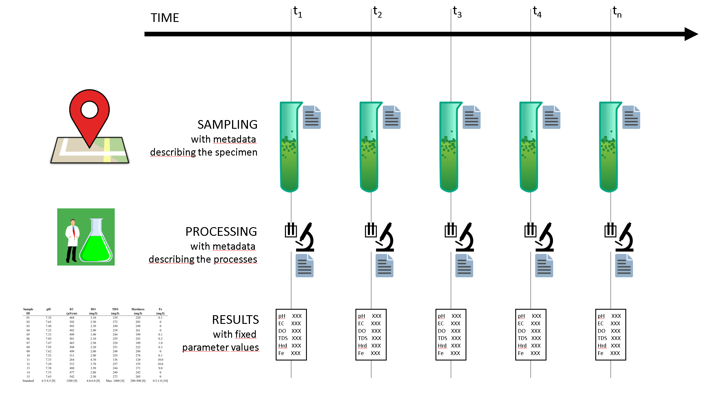
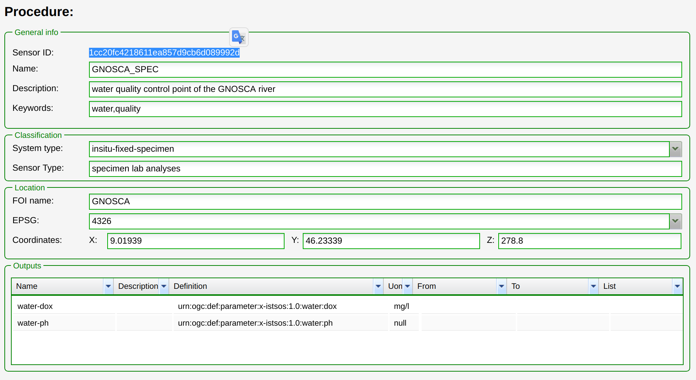
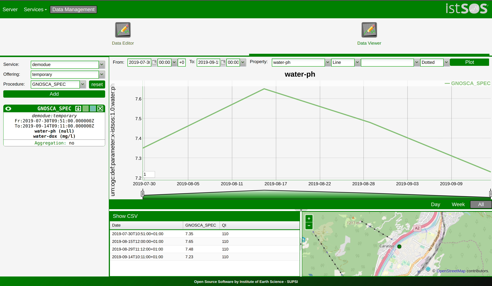

.. specimens:

============================
Managing specimen procedures
============================

With specimen procedures you are ablo to manage monitoring points whose
observations are the results of repeated specimens sampling and analyses.
Examples may be a well that periodically undergo to water sampling and
lab analyses for water quality monitoring, or periodic soil sampling
to quantify available nutrients.

So far in istSOS is possible to manage specimen type monitoring point
using the *walib*. Nevertheless data will be available as standard SOS.

Registering a new specimen procedure
====================================

We can use the standard istSOS web administration interface at
http://localhost/istsos/admin/

**1. Go to the 'demo' instance and create a new procedure:**

.. image:: images/newproc.png

**2. Fill in the form using the following values**:

.. code-block:: rest

    Name: GNOSCA_SPEC

    Description: water quality control point of the GNOSCA river

    System type: insitu-fixed-specimen

    Sensor type: specimen lab analyses

    EPSG: 4326

    x,y,z: 9.01939, 46.23339, 278.8

.. code-block:: rest

    Observed property: urn:ogc:def:parameter:x-istsos:1.0:water:ph

    Unit of measure: -

.. code-block:: rest

    Observed property: urn:ogc:def:parameter:x-istsos:1.0:water:dox

    Unit of measure: mg/l

**3. Register the new sensor**

Finally register the new sensor (procedure) pressing the **"submit"**
button and teke note of the **assigned procedure id**.

Specimen data structure
=======================

Data derived from a specimen consists in: **observations**,
**specimen metadata** and **processing details**.

.. code-block::json
    :linenos:

    {
        "eventTime": "2019-07-30T10:51:00+01:00",
        "observations": {
            "urn:ogc:def:parameter:x-istsos:1.0:water:ph": 7.35,
            "urn:ogc:def:parameter:x-istsos:1.0:water:dox": 3.10
        },
        "specimen": {
            "description": "A sample for the Lugano Lake water quality monitoring",
            "campaign": "2019",
            "identifier": "GNO_T1",
            "name": "Water quality Gnosca river",
            "sampledFeature": "http://www.istsos.org/demo/feature/GnoscaRiver",
            "materialClass": "http://www.istsos.org/material/water",
            "samplingMethod": "http://www.istsos.org/samplingMethod/bottle",
            "samplingtTime": "2019-07-30T10:51:00+01:00",
            "processingDetails": [
                {
                    "processOperator": "http://www.supsi.ch/ist?person=MarioBianchi",
                    "processingDetails": "http://www.istsos.org/processes/Electrometer",
                    "processingProtocol": "http://3.212.46.113/pdf/Env%20Engg%20Lab%20Manual.pdf",
                    "time": "2019-07-31T10:15:00+01:00"
                },
                {
                    "processOperator": "https://www.supsi.ch/ist?person=LucaRossi",
                    "processingDetails": "http://www.istsos.org/processes/OxidationKI",
                    "processingProtocol": "http://3.212.46.113/pdf/Env%20Engg%20Lab%20Manual.pdf",
                    "time": "2019-07-31T09:22:00+01:00"
                }],
            "size": {
                "value": 1,
                "uom": "http://www.uom/liter"
            },
            "currentLocation": {
                "href": "https://www4.ti.ch/dt/da/spaas/uma/ufficio/",
                "rel": "http://www.onu.org/offices",
                "title": "Ufficio Monitoraggio Ambientale - Canton Ticino"
            },
            "specimenType": "http://www.opengis.net/def/samplingFeatureType/OGC-OM/2.0/SF_Specimen"
        }
    }

* **"eventTime"** (Line 2) indicates the instant the values refer to
* **"observations"** (Line 3) indicates the key-value-pair elements (observedProperty, value) resulting from the processing of the specimen
* **"specimen"** (Line 7) indicates the metadata related to the specimen. The inner elements name are self explanatory, see the OGC standard SamplingSpecimen 2.0 for further details: this is a simplified Json representation.
* **"processingDetails"** (Line 16) defines a list of processes that the specimen undergo to produce the results

Insert specimen data
====================

To insert data from a specimen sampled at the GNOSCA_SPEC location we need to perform a **POST request**
with a specific JSON object in the body. The JSON includes the *Specimen data structure* described above.

.. info::
    If you are in a Linuex environment you can use the `curl <https://curl.haxx.se/docs/manpage.html>`_ command otherwise you can use an application like `Postman <https://www.getpostman.com/>`_.

Let's take a look to the json body we should POST:

.. code-block:: rest

    {
        "procedure_id": "1cc20fc4218611ea857d9cb6d089992d",
        "data": ... a single *Specimen data structure* or a list of *Specimen data structure*...
    }

**1. Open the file 'template_one_specimen.json'** 

With a text editor replace *my_assigned_specimen_id* with the actual assigned specimen id. Alternatively you can use the `sed <https://linux.die.net/man/1/sed>`_ command in a bash terminal

.. code-block:: bash
    
    $ sed 's/my_assigned_specimen_id/1cc20fc4218611ea857d9cb6d089992d/g' tmpl_GNOSCA_SPEC.json > gnosca_specimens.json

**2. Execute the POST** 

.. code-block:: bash

    $ curl -i -X POST \
        -H 'Content-Type: application/json' \
        --data @gnosca_specimens.json \
        http://localhost/istsos/wa/istsos/services/demodue/specimens

**3. Visualize inserted data**

Access specimens data structure
================================

Once specimens data are registered in istSOS you can access the result 
values with ordinary istSOS functionalities (GetObservation, etc..).

To acceess the complete specimen data structure you can use the walib:

* using the specimen identifier
* combining *event time* and *procedure name* filters

Get specimen data by specimen identifier
----------------------------------------

You can access a single specific specimen data using its **identifier** 
(that is for example the barcode of the sample whne sent to the laboratory) 
simply executing the following GET request with the following request:

.. code-block:: bash

    $ curl -X GET http://localhost/istsos/wa/istsos/services/demodue/specimens/GNO_T3

This will return a message with a single specimen

.. code-block:: json

    {"success": true, 
    "message": "Specimen(s) successfully retrived", 
    "data": 
        {"procedure": "GNOSCA_SPEC", 
        "observations": {"urn:ogc:def:parameter:x-istsos:1.0:water:dox": 2.3, "urn:ogc:def:parameter:x-istsos:1.0:water:ph": 7.48}, 
        "eventTime": "2019-08-29T12:12:00+02:00", 
        "specimen": {"description": "A sample for the Lugano Lake water quality monitoring", "campaign": "2019", "identifier": "GNO_T3", "name": "Water quality Gnosca river", "sampledFeature": "http://www.istsos.org/demo/feature/GnoscaRiver", "materialClass": "http://www.istsos.org/material/water", "samplingMethod": "http://www.istsos.org/samplingMethod/bottle", "samplingtTime": "2019-08-29T11:12:00+01:00", "processingDetails": [{"processOperator": "http://www.supsi.ch/ist?person=MarioBianchi", "processingDetails": "http://www.istsos.org/processes/Electrometer", "processingProtocol": "http://3.212.46.113/pdf/Env%20Engg%20Lab%20Manual.pdf", "time": "2019-08-29T10:15:00+01:00"}, {"processOperator": "https://www.supsi.ch/ist?person=LucaRossi", "processingDetails": "http://www.istsos.org/processes/OxidationKI", "processingProtocol": "http://3.212.46.113/pdf/Env%20Engg%20Lab%20Manual.pdf", "time": "2019-08-29T09:22:00+01:00"}], "size": {"value": 1, "uom": "http://www.uom/liter"}, "currentLocation": {"href": "http://www.ti.ch/umam", "rel": "http://www.onu.org/offices", "title": "Ufficio Monitoraggio Ambientale - Canton Ticino"}, "specimenType": "http://www.opengis.net/def/samplingFeatureType/OGC-OM/2.0/SF_Specimen"}
        }, 
    "total": 0}

Get the specimens data by procedure and time
--------------------------------------------
You can access data combining the time associated with the result values (etime) 
and the name of the associate procedure (procedure).

Excute a GET request with eventTime and procedureName paramters.

.. code-block:: bash

    $ curl -X GET 'http://localhost/istsos/wa/istsos/services/demodue/specimens?etime=2019-08-20T00:00:00%2B01/2019-10-01T00:00:00%2B01&procedure=GNOSCA_SPEC'
        
This will return a list of *Specimen data structure* objects

.. code-block:: json

    {
    "success": true, 
    "message": "Specimen(s) successfully retrived", 
    "data": [
        {"procedure": "GNOSCA_SPEC", 
        "observations": {"urn:ogc:def:parameter:x-istsos:1.0:water:ph": 7.48, "urn:ogc:def:parameter:x-istsos:1.0:water:dox": 2.3}, 
        "eventTime": "2019-08-29T12:12:00+02:00", 
        "specimen": {"description": "A sample for the Lugano Lake water quality monitoring", "campaign": "2019", "identifier": "GNO_T3", "name": "Water quality Gnosca river", "sampledFeature": "http://www.istsos.org/demo/feature/GnoscaRiver", "materialClass": "http://www.istsos.org/material/water", "samplingMethod": "http://www.istsos.org/samplingMethod/bottle", "samplingtTime": "2019-08-29T11:12:00+01:00", "processingDetails": [{"processOperator": "http://www.supsi.ch/ist?person=MarioBianchi", "processingDetails": "http://www.istsos.org/processes/Electrometer", "processingProtocol": "http://3.212.46.113/pdf/Env%20Engg%20Lab%20Manual.pdf", "time": "2019-08-29T10:15:00+01:00"}, {"processOperator": "https://www.supsi.ch/ist?person=LucaRossi", "processingDetails": "http://www.istsos.org/processes/OxidationKI", "processingProtocol": "http://3.212.46.113/pdf/Env%20Engg%20Lab%20Manual.pdf", "time": "2019-08-29T09:22:00+01:00"}], "size": {"value": 1, "uom": "http://www.uom/liter"}, "currentLocation": {"href": "http://www.ti.ch/umam", "rel": "http://www.onu.org/offices", "title": "Ufficio Monitoraggio Ambientale - Canton Ticino"}, "specimenType": "http://www.opengis.net/def/samplingFeatureType/OGC-OM/2.0/SF_Specimen"}}, 
        {"procedure": "GNOSCA_SPEC", 
        "observations": {"urn:ogc:def:parameter:x-istsos:1.0:water:ph": 7.23, "urn:ogc:def:parameter:x-istsos:1.0:water:dox": 2.9}, 
        "eventTime": "2019-09-14T11:11:00+02:00", 
        "specimen": {"description": "A sample for the Lugano Lake water quality monitoring", "campaign": "2019", "identifier": "GNO_T4", "name": "Water quality Gnosca river", "sampledFeature": "http://www.istsos.org/demo/feature/GnoscaRiver", "materialClass": "http://www.istsos.org/material/water", "samplingMethod": "http://www.istsos.org/samplingMethod/bottle", "samplingtTime": "2019-09-14T10:11:00+01:00", "processingDetails": [{"processOperator": "http://www.supsi.ch/ist?person=MarioBianchi", "processingDetails": "http://www.istsos.org/processes/Electrometer", "processingProtocol": "http://3.212.46.113/pdf/Env%20Engg%20Lab%20Manual.pdf", "time": "2019-09-14T10:15:00+01:00"}, {"processOperator": "https://www.supsi.ch/ist?person=LucaRossi", "processingDetails": "http://www.istsos.org/processes/OxidationKI", "processingProtocol": "http://3.212.46.113/pdf/Env%20Engg%20Lab%20Manual.pdf", "time": "2019-09-14T09:22:00+01:00"}], "size": {"value": 1, "uom": "http://www.uom/liter"}, "currentLocation": {"href": "http://www.ti.ch/umam", "rel": "http://www.onu.org/offices", "title": "Ufficio Monitoraggio Ambientale - Canton Ticino"}, "specimenType": "http://www.opengis.net/def/samplingFeatureType/OGC-OM/2.0/SF_Specimen"}}
        ], 
        "total": 2}

Delete specimens data structure
================================
For different reasons you may decide to delete inserted specimen data, this can be done using the DELETE request.
Beware that this request will delete not only the specimen metadata, but also the associated measurements.

.. warning:: when you delete all the specimens data in a time period, the procedure 
    observed period will be modified according the follwoing cases:

    .. code-block::  bash

        Case A (left overlapping)
        =========================================================================
        +------- deleted period ------------+
                                +------------------ observed period ------------+
                                            +---- resulting offered period -----+
        =========================================================================

        Case B (right overlapping)
        =========================================================================
                                            +------- deleted period ------------+
        +------------------ observed period ------------+
        +---- resulting offered period -----+
        =========================================================================

        Case C (extending)
        =========================================================================
        +-------------------------- deleted period -----------------------------+
                +------------------ observed period ------------+
                                resulting offered period is NULL
        =========================================================================

        Case D (inner)
        =========================================================================
                        +-------- deleted period --------+
                +------------------ observed period ------------+
                +---------- resulting offered period -----------+
        =========================================================================

Delete specimens data associate with a procedure in a time period
-----------------------------------------------------------------

Excute a DELETE request with eventTime and procedureName paramters.

.. code-block:: bash

    $ curl -X DELETE 'http://localhost/istsos/wa/istsos/services/demodue/specimens?etime=2019-09-10T00:00:00%2B02/2019-09-15T00:00:00%2B02&procedure=GNOSCA_SPEC'
        
This will return a messuage of success:

.. code-block:: json

    {"success": true, 
    "message": "Specimen(s) and related data succesfully deleted"}

.. warning::

    When you delete a single speciemns it doesn't modify the offered period

Delete specimens data by identifier
-----------------------------------

.. code-block:: bash

    $ curl -X DELETE 'http://localhost/istsos/wa/istsos/services/demodue/specimens/GNO_T3'

.. code-block:: json

    {"success": true, 
    "message": "Specimen(s) and related data succesfully deleted"}

        
Inserting eventTime in begin/end periods
========================================

istSOS prevent you to add new observations in a period that has been already observed.
So, for example if the observed period is untill today at 10:00 am when you try to add a measur of today at 09:00 am it rise an error.
This is justified by the fact that sensors collect and register data in a progressive time.

Nevertheless to permit to manage the cases when data are late or should be replaced for any reson, 
istSOS implements a forceInsert parameter that permits to ignore this constrain.

Similarly it is possible in inserting a new specimen (POST request) to use the parameter **forceInsert=true**

Let's see this:

**1. set your procedure id in the json**

.. code-block:: bash
    
    $ sed 's/my_assigned_specimen_id/1cc20fc4218611ea857d9cb6d089992d/g' tmpl_GNOSCA_SPEC_20190901.json > gnosca_specimens_20190901.json

**1. execute a post request for an eventTime in the offered period**

.. code-block:: bash

    $ curl -i -X POST \
        -H 'Content-Type: application/json' \
        --data @gnosca_specimens_20190901.json \
        http://localhost/istsos/wa/istsos/services/demodue/specimens

**2. repeat the same request setting forceInsert=true**

.. code-block:: bash

    $ curl -i -X POST \
        -H 'Content-Type: application/json' \
        --data @gnosca_specimens_20190901.json \
        'http://localhost/istsos/wa/istsos/services/demodue/specimens?forceInsert=true'

