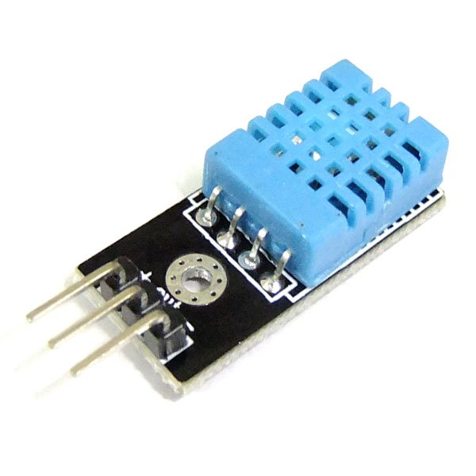
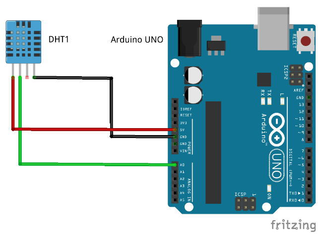
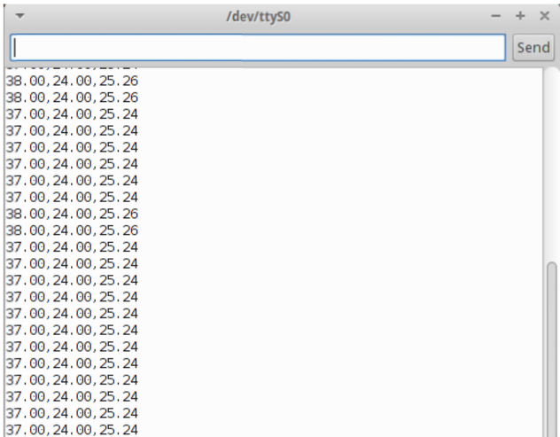
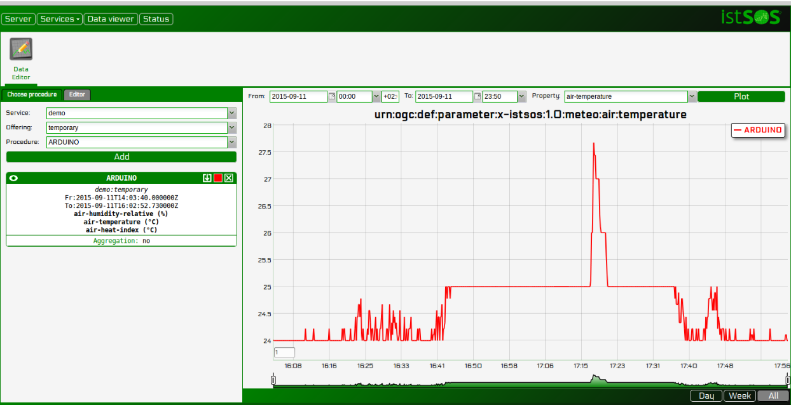
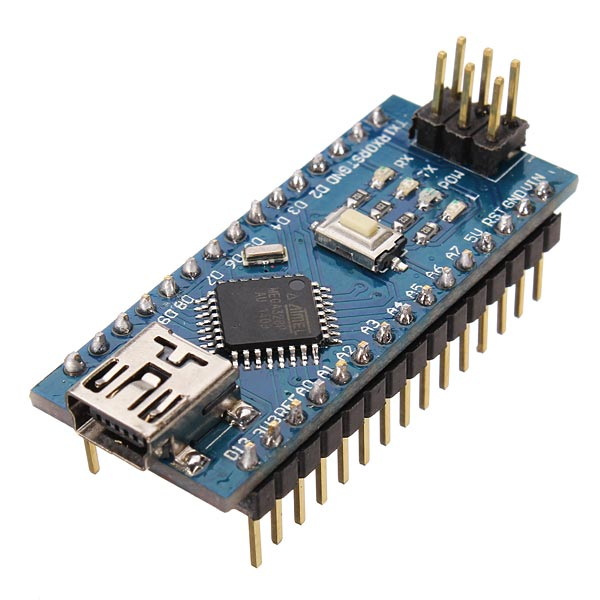
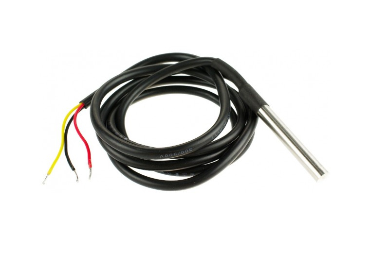
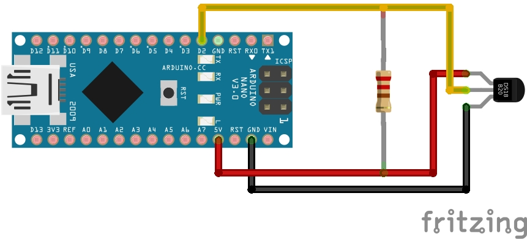

.. _ws_arduino:

===================
Arduino with istSOS
===================

Here you can find a quick guide on how to connect an Arduino UNO or NANO with
a sensor and send the data to an istSOS server.

Connecting Arduino UNO with DHT11 sensor and upload data to istSOS
------------------------------------------------------------------

**Arduino UNO Rev. 3**

Arduino is an open-source prototyping platform based on easy-to-use hardware
and software. Arduino boards are able to read inputs - light on a sensor, a
finger on a button, or a Twitter message - and turn it into an output -
activating a motor, turning on an LED, publishing something online. All
this is defined by a set of instructions programmed through the Arduino
Software (IDE).

.. figure::  images/arduino-uno.jpg

**DHT11 sensor**

The DHT11 is a basic, ultra low-cost digital temperature and humidity sensor.
It uses a capacitive humidity sensor and a thermistor to measure the
surrounding air, and spits out a digital signal on the data pin (no
analog input pins needed). It’s fairly simple to use, but requires
careful timing to grab data. The only real downside of this sensor
is you can only get new data from it once every 2 seconds, so when
using our library, sensor readings can be up to 2 seconds old.

Details:

- Good for 20-80 % humidity reading with 5% accuracy
- Good for 0-50 °C temperature reading +/- 2°C accuracy
- Low cost

Mounting instruction
^^^^^^^^^^^^^^^^^^^^

**Connect the DHT11 sensor to Arduino board**

==============  ===============
**DHT11 pin**   **Arduino Pin**
`+`             5V
out             A0
`-`             GND
==============  ===============

Schema

Setup
^^^^^^^

Arduino can be connected to your PC through the USB port. The mainboard use
the serial port to communicate.

**Set your Arduino Software environment**

Arduino boards are able to read inputs and turn it into an output. All this
is defined by a set of instructions programmed through the Arduino Software
(IDE) and uploaded to the microcontroller.

- Install the DHT  sensor library using the "Library Manager"
  (Sketch > Include Library.. > Manage Library)

**Upload to Arduino the script to read data**

- Open your Arduino IDE program and paste this code:

.. code-block:: c

    DHT dht(DHTPIN, DHTTYPE);

    void setup() {
        Serial.begin(9600);
        dht.begin();
    }

    void loop() {
        // Wait a few seconds between measurements.
        delay(1000);

        // Reading temperature or humidity
        float h = dht.readHumidity();
        // Read temperature as Celsius (the default)
        float t = dht.readTemperature();
        // Read temperature as Fahrenheit (isFahrenheit = true)
        float f = dht.readTemperature(true);

        // Check if any reads failed and exit early (to try again).
        if (isnan(h) || isnan(t)) {
            Serial.println("Failed to read from DHT sensor!");
            return;
        }

        // Compute heat index in Celsius (isFahreheit = false)
        float hic = dht.computeHeatIndex(t, h, false);

        Serial.print(h);
        Serial.print(',');
        Serial.print(t);
        Serial.print(',');
        Serial.println(hic);
    }

.. note::

    Before uploading the program to the board verify the code to avoid error
    like missing library. Then if no error upload the code to the Arduino
    board.

**Visualize your measurements**

To check if the the program is correctly running use the serial monitor.

Data acquisition
^^^^^^^^^^^^^^^^

First let’s create a new Arduino sensor in istSOS, add procedure arduino with
multiple observed properties:

==================  ========================================
**Name:**           arduinouno
**Description:**    Arduino board used in the tutorial
**Keywords:**       arduino,air,temperature,humidity

**System type:**    insitu-fixed-point
**Sensor type:**    DHT11

**FOI name:**       GENOVA
**EPSG:**           4326
**Coordinates:**    x: 44.4029 y: 8.9587 z: 63
==================  ========================================

Add relative humidity:

======================= ================================================================
**Observed property**   `urn:ogc:def:parameter:x-istsos:1.0:meteo:air:humidity:relative`
Unit of measure:        %
======================= ================================================================

Add air temperature:

======================= ===============================================================
**Observed property:**  `urn:ogc:def:parameter:x-istsos:1.0:meteo:air:temperature`
Unit of measure:        °C
======================= ===============================================================

Add heat index:

======================= ===============================================================
**Observed property:**  `urn:ogc:def:parameter:x-istsos:1.0:meteo:heat:index`
Unit of measure:        °C
======================= ===============================================================

Register the new sensor (procedure) pressing the "**submit**" button.

Now it’s time to read the data coming from arduino and upload them to istSOS.
In the script folder of istsos you can find the serial2istsos.py file.

.. note::

    This script  is an example of how to read data from the serial output
    and send data in real time to istSOS using the WA-REST API.

    .. code-block:: bash

        python script/serial2istsos.py --help

        usage: serial2istsos.py [-h] [-v] [-c C] [-x X] [-b B] [-p P] [-u url]
                        [-s service] [-user user name] [-password password]

        Load data read from a serial port and execute insert data to istSOS

        optional arguments:
          -h, --help          show this help message and exit
          -v                  Activate verbose debug
          -c C                Config file instead of inline params
          -x X                Serial port to listen
          -b B                serial port baudrate
          -p P                Procedure name
          -u url              istSOS Server address IP (or domain name) used for all
                              request. (default: http://localhost:80/istsos).
          -s service          The name of the service instance.
          -user user name
          -password password

    The configuration file:

    .. code-block:: json

        {
            "url": "http://istsos.org/istsos",
            "service": "demo",
            "port": "/dev/ttyACM0",
            "baud": "9600",
            "procedure": "arduino",
            "aggregationInterval": "PT10S",
            "observations": [{
                "name": "urn:ogc:def:parameter:x-istsos:1.0:meteo:air:humidity:relative",
                "column": 13,
                "nodata": -1,
                "aggregation": "avg"
            },{
                "name": "urn:ogc:def:parameter:x-istsos:1.0:meteo:air:temperature",
                "column": 14,
                "aggregation": "avg"
            },{
                "name": "urn:ogc:def:parameter:x-istsos:1.0:meteo:air:heatindex",
                "column": 2,
                "aggregation": "avg"
            }]
        }

    Date time configuration variations are optional, if not given, current
    timestamp will be used, other configurations

Execute the script, but close the Arduino IDE “Serial Monitor” if still opened.

.. code-block:: bash

    cd /usr/share/istsos
    python scripts/serial2istsos.py -v -c /home/user/Desktop/Tutorial/arduino/arduino-uno.json

You can check your data in the “Data Viewer”

Connecting Arduino NANO with a DS18B20 Temperature and upload data to istSOS
-----------------------------------------------------------------------------

Arduino NANO

The Arduino Nano is a small, complete, and breadboard-friendly board based on
the ATmega328 (Arduino Nano 3.x). It has more or less the same functionality
of the Arduino Duemilanove, but in a different package. It lacks only a DC
power jack, and works with a Mini-B USB cable instead of a standard one.

DS18B20 Temperature probe

Details:

- 0.5°C accuracy
- Waterproof
- Very cheap

Mounting instruction
^^^^^^^^^^^^^^^^^^^^

**Connect the DS18B20 sensor to Arduino Nano board**

==============  ===============
**DS18B20**     **Arduino Pin**
Black           GND
RED             5v
YELLOW          d2
==============  ===============

Setup
^^^^^^^

Arduino can be connected to your PC through the USB port. The mainboard use
the serial port to communicate.

**Set your Arduino Software environment**

Arduino boards are able to read inputs and turn it into an output. All this
is defined by a set of instructions programmed through the Arduino Software
(IDE) and uploaded to the microcontroller.

- Install the OneWire, DallasTemperature library using the "Library Manager"
  (Sketch > Include Library.. > Manage Library)

**Upload to Arduino the script to read data**

- Open your Arduino IDE program and paste this code:

.. code-block:: c

    #include <OneWire.h>
    #include <DallasTemperature.h>

    // Data wire is plugged into pin 2 on the Arduino
    #define ONE_WIRE_BUS 2

    // Setup a oneWire instance to communicate with any OneWire devices
    OneWire oneWire(ONE_WIRE_BUS);

    // Pass our oneWire reference to Dallas Temperature.
    DallasTemperature sensors(&oneWire);

    void setup(void)
    {
        Serial.begin(9600);
        sensors.begin();
    }

    void loop(void)
    {
        sensors.requestTemperatures();
        Serial.println(sensors.getTempCByIndex(0));
        delay(1000);
    }

.. note::

    Before uploading the program to the board verify the code to avoid error
    like missing library. Then if no error upload the code to the Arduino
    board.

Data acquisition
^^^^^^^^^^^^^^^^

First let’s create a new Arduino sensor in istSOS, add procedure arduino with
multiple observed properties:

==================  ========================================
**Name:**           arduinonano
**Description:**    Arduino board used in the tutorial
**Keywords:**       arduino,air,temperature

**System type:**    insitu-fixed-point
**Sensor type:**    DHT11

**FOI name:**       GENOVA
**EPSG:**           4326
**Coordinates:**    x: 44.4029 y: 8.9587 z: 63
==================  ========================================

Add air temperature:

======================= ===============================================================
**Observed property:**  `urn:ogc:def:parameter:x-istsos:1.0:meteo:air:temperature`
Unit of measure:        °C
======================= ===============================================================

Register the new sensor (procedure) pressing the "**submit**" button.

Now it’s time to read the data coming from arduino and upload them to istSOS.
In the script folder of istsos you can find the serial2istsos.py file.

.. note::

    This script  is an example of how to read data from the serial output
    and send data in real time to istSOS using the WA-REST API.

    .. code-block:: bash

        python script/serial2istsos.py --help

        usage: serial2istsos.py [-h] [-v] [-c C] [-x X] [-b B] [-p P] [-u url]
                        [-s service] [-user user name] [-password password]

        Load data read from a serial port and execute insert data to istSOS

        optional arguments:
          -h, --help          show this help message and exit
          -v                  Activate verbose debug
          -c C                Config file instead of inline params
          -x X                Serial port to listen
          -b B                serial port baudrate
          -p P                Procedure name
          -u url              istSOS Server address IP (or domain name) used for all
                              request. (default: http://localhost:80/istsos).
          -s service          The name of the service instance.
          -user user name
          -password password

    The configuration file:

    .. code-block:: json

        {
            "url": "http://istsos.org/istsos",
            "service": "demo",
            "port": "/dev/ttyUSB0",
            "baud": "9600",
            "procedure": "arduinonano",
            "header": 0,
            "aggregationInterval": "PT10S",
            "observations": [{
                "name": "urn:ogc:def:parameter:x-istsos:1.0:meteo:air:temperature",
                "column": 0,
                "aggregation": "avg"
            }]
        }

    Date time configuration variations are optional, if not given, current
    timestamp will be used, other configurations

Execute the script, but close the Arduino IDE “Serial Monitor” if still opened.

.. code-block:: bash

    cd /usr/share/istsos
    python scripts/serial2istsos.py -v -c /home/user/Desktop/Tutorial/arduino/arduino-nano.json
