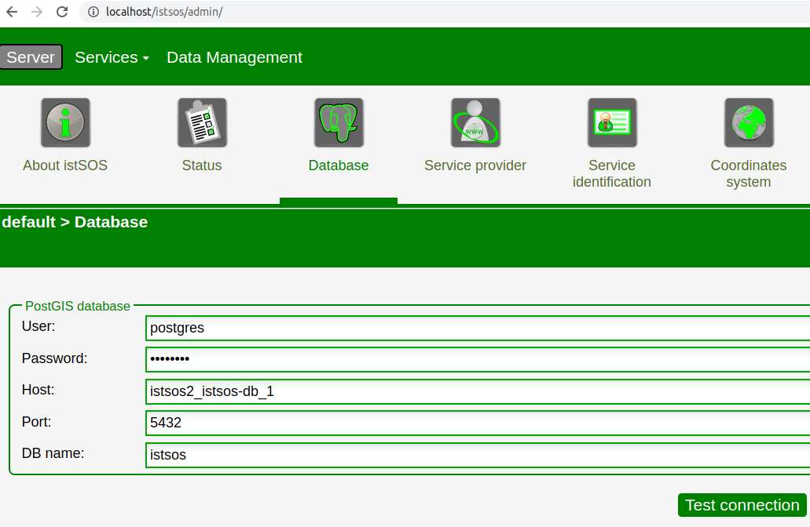

.. _ws_database:

======================
Database configuration
======================

----------------------------------------------------------------------
PostgreSQL configuration for source/Debian-package istSOS installation 
----------------------------------------------------------------------

Decide where to install the PostgreSQL database. Most of the times installing the database on the same machine is ok.

**Install PostgreSQL and PostGIS**

.. code-block:: bash

    sudo apt install postgresql postgis

.. *Optionally install also PGAdmin*

.. .. code-block:: bash

..     sudo apt-get install pgadmin3

**Change the postgreSQL password**

.. code-block:: bash

    sudo -u postgres psql -c "alter user postgres password 'postgres';"

.. note::

    replace the example password with something stronger if you like

**Create the istSOS database**

.. code-block:: bash

    sudo -u postgres createdb -E UTF8 istsos
    sudo -u postgres psql -d istsos -c 'CREATE EXTENSION postgis'

Now your istSOS server is ready to be used.

--------------------------------------------------------
PostgreSQL configuration for docker-compose installation
--------------------------------------------------------

PostgreSQL is ready and configured in the istSOS docker-compose version. 
You should only set database parameters on istSOS database page.

**Launch administration page**

If everything has gone well, you should see the administration page at
this address:
    `http://localhost/istsos/admin/ <http://localhost/istsos/admin/>`_

**Configure postgreSQL on istSOS**

To connect istSOS to postgreSQL, click on Database section and set database parameters.
If you don't change postgres parameters in docker-compose.yml you should edit 
only the host field with the name of the docker-compose service: istsos2_istsos-db_1. 
Test connection and press submit.

**Check running database service**

Eventually edit host field using the listed postgres service.

.. code-block:: bash

    docker ps | grep istsos-db

**Change postgreSQL password** 

If you like, you can replace the example password with something stronger editing 
the POSTGRES_PASSWORD variable in the docker-compose.yml .

**Using local or remote postgreSQL**

Feel free to use your local or remote postgreSQL, you should only comment or delete the istsos-db service 
section in the docker-compose.yml and set the right database parameters in the database page.

