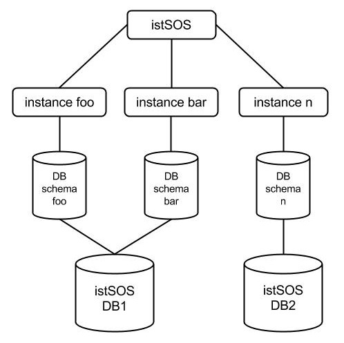

.. _ws_instances:

=====================================
Setting up an istSOS service instance
=====================================

With istSOS you can organize your sensor data in different instances. Every
instance has its own database schema independent from other instances. You
can even deploy other databases over your network according to your needs.

The first steps into istSOS setup is to configure the default configuration
options. These options will then be automatically used for your convenience
by every new istSOS instance created.

**Now open the Web Admin interface**

`http://localhost/istsos/admin/ <http://localhost/istsos/admin/>`_

**Configure your default database connection**

From the toolbar buttons menu press the database button and fill in the
database configuration options:

=========  =========
user:      postgres
password:  postgres
host:      localhost
port:      5432
DB name:   istsos
=========  =========

*Press the “test connection” button to check if parameters are correct.*

**Configure the default Service provider information**

Use your institutional information.

**Configure the default Service identification information**

Fill up with custom metadata that describe the service usage.

**Configure your service coordinates system**

Default EPSG code: this will be the native Coordinate Reference Systems of your
geometries in the database.

Permitted EPSG: here you can configure which other Coordinate Reference Systems
your system will support and reproject if requested.

**Configure your getobservation request options**

Set maximum time interval per GetObservation requests (zero for no limits) and
aggregation no-data value.

**Configure your service proxy address**

The Proxy URL field is the base URL seen beyond a reverse proxy.

Creating a new service instance
-------------------------------

Now that you have configured istSOS, it’s time to create a new service instance.

**Create a new service**

Choose the name of your instance. In this workshop use the name demo.
Here you could also change the default EPSG and database configuration for this
istSOS instance if you prefer to not use the defaults ones.

**Press “next”.**

As you pressed the “next” button, the server status panel is displayed.
If something's gone wrong during the creation you will see here an alert.

**Check if the new service exists asking for a GetCapabilities**

Now the istSOS “demo” instance is up and running.  Let’s try to execute a
getCapabilities request.

`http://localhost/istsos/demo?request=getCapabilities&service=SOS
<http://localhost/istsos/demo?request=getCapabilities&service=SOS>`_

.. note::

    The istSOS “demo” instance has inherited all the configuration options
    from the default configuration. If, for any reason you decide to modify
    them, the changes will affect only this instance.
