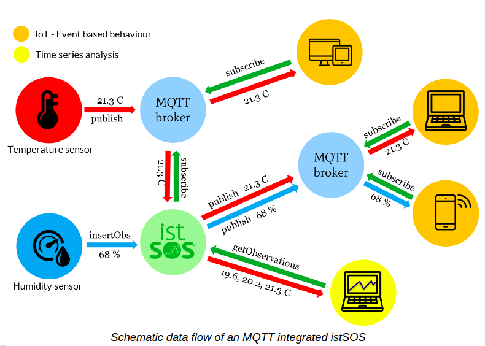
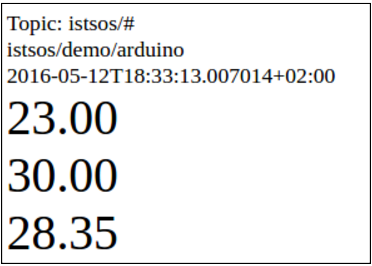

.. _ws_mqtt:

=================
MQTT Broadcasting
=================

**MQTT**
From http://mqtt.org/:

"*MQTT is a machine-to-machine (M2M)/"Internet of Things" connectivity protocol.
It was designed as an extremely lightweight publish/subscribe messaging
transport. It is useful for connections with remote locations where a small
code footprint is required and/or network bandwidth is at a premium.
For example, it has been used in sensors communicating to a broker via
satellite link, over occasional dial-up connections with healthcare
providers, and in a range of home automation and small device scenarios.
It is also ideal for mobile applications because of its small size, low
power usage, minimised data packets, and efficient distribution of
information to one or many receivers (more http://mqtt.org/faq>)*"

.. figure::  images/mqtt-flow.png

MQTT and istSOS
---------------

.. warning::

    THIS FEATURE IS STILL EXPERIMENTAL - WE ARE WORKING HARD TO RELEASE SOON
    A STABLE VERSION - MORE TESTING IS REQUIRED (AND YOU ARE WELCOME TO
    CONTRIBUTE WITH BUG REPORTING)

Since version 2.3.2 istSOS support MQTT, and specifically can:

1. Receive observations from a MQTT broker (instead of using a
   insertObservation, published data are stored in istSOS and available to
   SOS clients)

2. Publish received observations to a MQTT broker (when a insertObservation
   is received and the data is stored they are automatically broadcasted
   to the MQTT broker)

Enabling MQTT broadcasting in istSOS
^^^^^^^^^^^^^^^^^^^^^^^^^^^^^^^^^^^^

**Install the Paho client**

This feature require a MQTT python library. In this example we will use the
Paho Python Client (https://eclipse.org/paho/clients/python), but istSOS has
also been tested with HBMQTT (http://hbmqtt.readthedocs.io/en/latest).

To install the Paho Python Client run:

.. code-block:: bash

    sudo pip install paho-mqtt

**Enable measurements broadcasting**

To enable measurements broadcasting go to the "MQTT Publisher" page and
register to a MQTT Broker. In this tutorial we will use the Open Source MQTT
broker Mosquitto (http://mosquitto.org) available online for testing.

**MQTT Broker**:
=========== =================
URL:        iot.eclipse.org
Port:       1883
Topic Base: foss4g2016/
=========== =================

Now you can now observe in realtime all the new observations by opening
this example html page: http://istsos.org/mqtt/index.html?topic=foss4g2016

This is what you should see:

**Enabling MQTT harvesting in istSOS**
