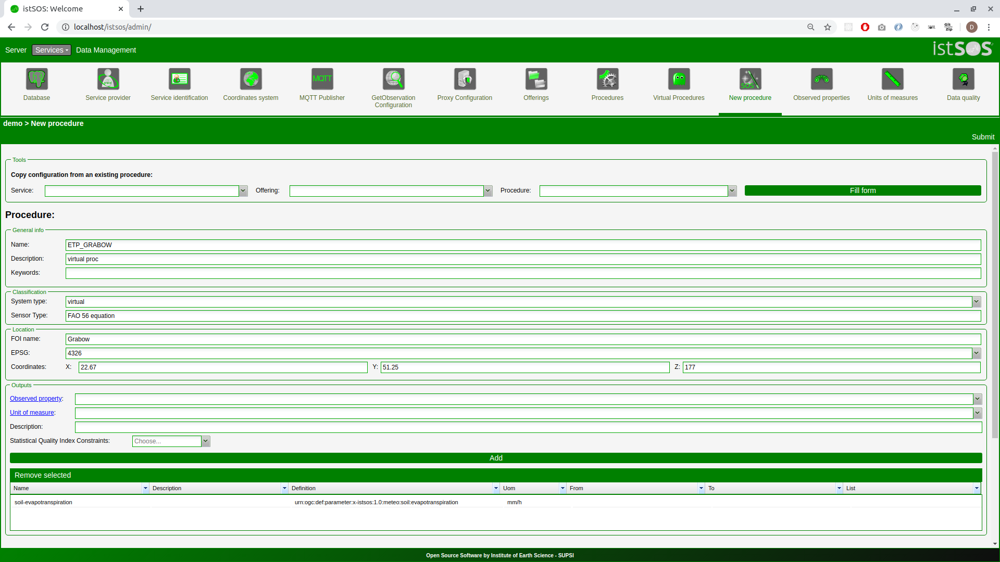

.. _ws_virtualprocedures:

===========================
Creating Virtual Procedures
===========================

With Virtual Procedures you are able to use other procedures data (real or
virtual) and manipulate data to get a different result.

.. figure::  images/virtual_proc.png

.. warning::

    When working with VP it’s easy to make some mistakes while coding.. So
    while testing your VP look at the apache error log to read about errors:

    .. code-block:: bash

        tail -f /var/log/apache2/error.log

    If something goes wrong or you do some modification on your code, you
    should also restart the apache server.

    .. code-block:: bash

        sudo service apache2 restart

When you have filled up istSOS automatically you have
create a couple of virtual procedures:

**V_LUGANO**: it gets data from a sensor measuring temperature in Celsius
degree (T_LUGANO) and transforms it to Fahrenheit degree, here is the code:

.. code-block:: python

    from istsoslib.responders.GOresponse import VirtualProcess
    class istvp(VirtualProcess):
        procedures = {
            "T_LUGANO": "urn:ogc:def:parameter:x-istsos:1.0:meteo:air:temperature"
        }
        def execute(self):
            data = self.getData("T_LUGANO")
            out=[]
            for idx in range(len(data)):
                rec = data[idx]
                if self.filter.qualityIndex == True:
                    out.append([rec[0], self.convert(rec[1]), rec[2]])
                else:
                    out.append([rec[0], self.convert(rec[1])])
            return out
        def convert(self, celsius):
            if celsius is None:
                return -999.9
            return (float(celsius) *1.8 + 32)

Test the virtual procedure executing a getObservation request
`here <http://localhost/istsos/demo?service=SOS&version=1.0.0&request=GetObservation&offering=temporary&procedure=V_LUGANO&eventTime=2015-06-02T00%3A00%3A00%2B01%3A00%2F2015-06-03T00%3A00%3A00%2B01%3A00&observedProperty=temperature&responseFormat=text%2Fplain>`_

**V_GNOSCA**: transforms river water levels in river discharge appling a rating
curve defined with different parameters for different periods.

Here is the code, which instantiate a special istSOS virtual procedure
class (VirtualProcessHQ):

.. code-block:: python

    from istsoslib.responders.GOresponse import VirtualProcessHQ
    class istvp(VirtualProcessHQ):
        procedures = {
            "RH_GNOSCA": "urn:ogc:def:parameter:x-istsos:1.0:river:water:height"
        }

Select the “Rating curve” tap panel to see the rating curves values:

.. figure::  images/rating_curve.png

Test the virtual procedure executing a getObservation request
`here <http://localhost/istsos/demo?service=SOS&version=1.0.0&request=GetObservation&offering=temporary&procedure=V_GNOSCA&eventTime=2015-06-02T00%3A00%3A00%2B01%3A00%2F2015-06-03T00%3A00%3A00%2B01%3A00&observedProperty=discharge&responseFormat=text%2Fplain>`_

Creating a reference evapotranspiration virtual procedure manually
^^^^^^^^^^^^^^^^^^^^^^^^^^^^^^^^^^^^^^^^^^^^^^^^^^^^^^^^^^^^^^^^^^

Evapotranspiration is an important parameter that takes part in the water
balance assessment, and therefore in any attempt to calculate and predict
plant water needs and optimized irrigation. ENORASIS use evapotranspiration
as one of the component to feed the innovative advanced algorithms and
optimization processes leading to irrigation optimized scheduling.

.. note::

    A possible approach it to assess water needs by using a daily water balance
    calculation considering rainfall and irrigations as the water inputs and
    crop evapotranspiration (ETc ) as the loss. The water balance for a
    particular irrigation block, in millimetres, can then be calculated
    using the formula:

    .. code-block::

        WB = R + I - ETc

    Where:

    - WB = water balance (mm)
    - R = rainfall depth (mm)
    - I = irrigation volumes (mm/area)
    - ET c = crop evapotranspiration (mm/area)

    In this approach, the water balance does not include water stored in the
    soil profile. This is a simplification but it avoids the difficulty of
    trying to build a complex system reliant on accurate soil moisture
    accounting, that in many circumstances adds little benefit as the
    other agronomic or cultural preferences are unknown. In contrast to
    `ENORASIS <http://www.enorasis.eu>`_, a system operating in this mode
    does therefore not tell irrigators when and how much to irrigate, but
    provides an indication on how much water the crop has used since last
    irrigation. The decision when to irrigate is up to the grower based
    upon all the agronomic, economic and social/cultural considerations.

**Create a virtual procedure named ETP_GRABOW observing Evapotranspiration**

**Copy the FAO56 python function in the virtual procedure folder
of ETP_GRABOW**

If installed from source

.. code-block:: bash

    sudo cp ~/Desktop/Tutorial/vp/FAO56.py /usr/local/istsos/services/demo/virtual/ETP_GRABOW

If installed from debian package

.. code-block:: bash

    sudo cp ~/Desktop/Tutorial/vp/FAO56.py /usr/share/istsos/services/demo/virtual/ETP_GRABOW

Open the `file <https://github.com/istSOS/istsos2/blob/master/Tutorial/vp/FAO56.py>`_
to check the function ET0 which calculate evapotranspiration from a number
of inputs:

.. code-block:: python

    '''
    =======================================================================
    Potential evaporation functions using Penman-Montheit with hourly data
    =======================================================================
    '''

    def ET0(isodate,T,RH,u2,Rs,lat,lon,z,P=None,verbose=False):

        """
        Input:
            isodate: (str) iso datetime in UTC
            T: (float) hourly air temperature at 2m [Celsius]
            RH: (float) hourly relative air humidity [Pa]
            u2: (float) hourly wind speed at 2 m [m/s]
            Rs: (float) hourly incoming solar radiation [J/m2/hour]
            lat: (float) latitude of the measurement point [decimal degree]
            lon: (float) longitude of the measurement point [decimal degree]
            z: (float) altitude above sea level of the measurement point [m]
            P: (float) hourly air pressure [Pa] (Opzional)

        Output:
            - ET0: (float) hourly reference evapotranspiration [mm/h]

        Examples::
            >>> import FAO56
            >>> FAO56.ET0(isodate="2015-10-01T02:00Z",T=28,RH=90,u2=1.9,
                             Rs=0,lat=16.21,lon=-16.26,z=8)
            >>>
            >>> FAO56.ET0(isodate="2015-10-01T14:00Z",T=38,RH=52,u2=3.3,
                             Rs=2.450,lat=16.21,lon=-16.26,z=8)
            >>> 0.626874880652

        References:
            http://www.fao.org/docrep/X0490E/x0490e00.htm#Contents

        """

**Code the evapotranspiration virtual procedure**

.. code-block:: python

    # -*- coding: utf-8 -*-
    # import
    from istsoslib.responders.GOresponse import VirtualProcess

    import FAO56

    class istvp(VirtualProcess):

        procedures = {
            "GRABOW": [
                "urn:ogc:def:parameter:x-istsos:1.0:meteo:air:temperature",
                "urn:ogc:def:parameter:x-istsos:1.0:meteo:air:humidity:relative",
                "urn:ogc:def:parameter:x-istsos:1.0:meteo:air:wind:velocity",
                "urn:ogc:def:parameter:x-istsos:1.0:meteo:solar:radiation"
            ]
        }

        def execute(self):

            data = self.getData("GRABOW")
            data_out = []
            for rec in data:
                if self.filter.qualityIndex == True:
                    # rec is a list:
                    # [0]=time, [1]=T,[2]=Tqi, [3]=RH,[4]=RHqi,
                    # [5]=u2,[6]=u2qi, [7]=Rs,[8]=Rsqi
                    etp = FAO56.ET0(isodate = str(rec[0]),
                          T=float(rec[1]),
                          RH=float(rec[3]),
                          u2=float(rec[5]),
                          Rs=float(rec[7])*0.0036, # W/m2 to MJ/(m2*h)
                          lat=22.67,
                          lon=51.25,
                          z=177)
                    data_out.append([rec[0], etp, min([rec[2],rec[4],rec[6],rec[8]])])
                else:
                    # rec is a list: [0]=time,[1]=T,[2]=RH,[3]=u2,[4]=Rs
                    etp = FAO56.ET0(isodate = str(rec[0]),
                          T=float(rec[1]),
                          RH=float(rec[2]),
                          u2=float(rec[3]),
                          Rs=float(rec[4])*0.0036,
                          lat=22.67,
                          lon=51.25,
                          z=177)
                    data_out.append([rec[0], etp])
            return data_out

Test the virtual procedure with the “Data Viewer”
