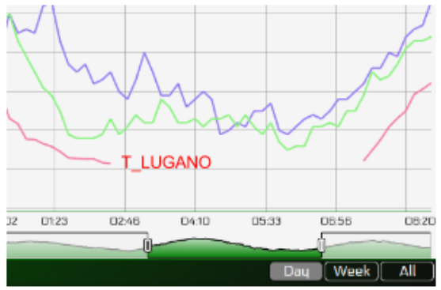
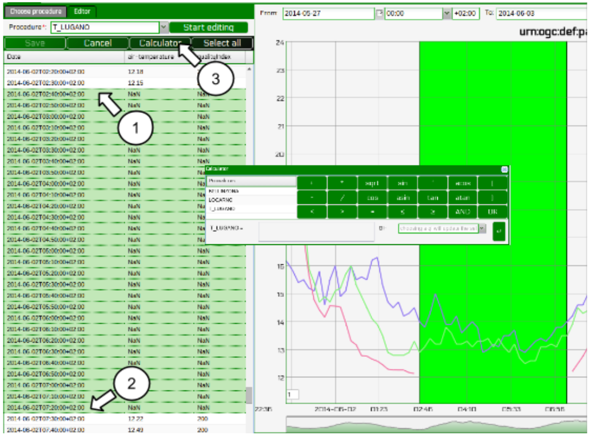

.. _editobs:

=====================
Editing observations
=====================

The procedure T_LUGANO has some problems: from 2014-06-02T02:40:00 to 2014-06-02T07:20:00 there are no data values:

.. code-block:: rest

    urn:ogc:def:parameter:x-istsos:1.0:time:iso8601,urn:ogc:def:parameter:x-
    istsos:1.0:meteo:air:temperature
    [...]
    2014-06-02T02:30:00.000000+0200,12.150000
    2014-06-02T02:40:00.000000+0200,-999.9
    2014-06-02T02:50:00.000000+0200,-999.9
    2014-06-02T03:00:00.000000+0200,-999.9
    [...]

We can correct them using the Data Editor!

.. image:: images/data_editor_btn.png

.. rubric:: *Load the data*

From the Web Admin:

    - Go to Data Viewer
    - Press the Data Editor button
    - Like in the Data Viewer sequentially choose
        - the service **demo**,
        - the offering **temporary**
        - and then “Add” **BELLINZONA**, **LOCARNO** and **T_LUGANO**

.. image:: images/load_data.png

And:

    - On the right panel choose the Property: air-temperature
    - Press “Plot”, the last week of measurements is loaded and displayed

.. image:: images/data_loaded.png

.. rubric:: *Editing with the “Calculator”*

On the left panel there is the “Editor” tab:

.. image:: images/editor_tab.png

In the tab:
    - Select T_LUGANO from the combo list
    - The press “Start editing”, the grid is now displayed
    - At the bottom-right corner of the chart there are 3 buttons “Day”, “Week” and “All”
        - Click on “Day”, the chart is zoomed to contain only one day of data
        - Drag the timeline bar on the right where you will see that T_LUGANO has no data

And:
    - Click on the chart to select the last observation before the “nodata” hole, a green line is displayed and in the Editing Grid the corresponding row is selected.
    
    - Now go to the Editing Grid panel
        1) Click the first row where data are NaN,
        2) Scroll to the last NaN record and holding the SHIFT Key click on it
        3) The press the “Calculator” button
    

    
WIth the Calculator we are able to correct an interval of data in a single action. It is possible to set a numeric value or also use a function using data from the other loaded procedures.
Let‟s build a function that make the average of the data from BELLINZONA and LOCARNO and then
removes to units: 

.. code-block:: rest

       ((BELLINZONA+LOCARNO)/2)-2
       
Select the quality index. In this case we can choose a QI 500 (manually adjusted).
    
.. image:: images/calculator.png

