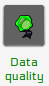
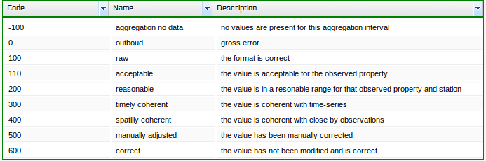

.. _quality:

================================
Quality indexes of observations
================================

Data validation with quality index
===================================

The basic idea is that measures once observed go trough a series of validation tests, if a test is passed a higher level of quality index is reached.

istSOS is bundled with an automatic data validation in real time during observation insertion for the value correctness and statistically sound.

In the next paragraphs we will see 3 levels of validation.

.. image:: images/qi.png

.. note::
    to set the default qualityIndex value look at the  *GetObservationConfiguration* panel

    _
    
    .. image:: images/getobs.png

To customize the quality index you can use the configuration panel 

where you can change the value and the meaning of default istSOS quality indexes

.. rubric:: Raw data quality index (100 - Raw)
For every new inserted observed property the raw data quality index is assigned (by default QI 100 Raw data). This quality index suggests that the observation data type is correct, which means that istSOS checks if the measure inserted is in a numeric type.

.. rubric:: Correct quality index (110 - Acceptable)
In the observed properties panel, for each observed property, you can define specific constraint based on logical operators (greater than, Lower than, between and value list). This is the place where you can set general quality index check for each Observed Property. For instance a percentage (%) observed property can use a constraint of type “Between”, because the values can be between 0% and 100%.

.. rubric:: Statistical quality index (200 - Resonable)
The statistical QI is more granular. This is set when you create a new procedure and it will be specific only to the new procedure created. For instance in the case of temperature measurements, we know that in our region temperature never goes under -20°C and over 40°C, so we can put as correct QI the “between” constraint. But a new sensor deployed on top of a mountain the limits are different and the QI constraint can be more specific for this station (between -20° and +20°C).

Accessing Quality index of observations
========================================

To access the quality index of registered observations you can specify an istSOS extending parameter *qualityIndex* which can assume the value *true* or *false*.

.. rubric:: *Example*

`<http://localhost/istsos/demo?service=SOS&version=1.0.0&request=GetObservation&offering=temporary&procedure=T_LUGANO&eventTime=2014-06-03T15%3A20%3A00%2B01%3A00%2F2014-06-03T15%3A50%3A00%2B01%3A00&observedProperty=temperature&responseFormat=text/plain&qualityIndex=True>`_

