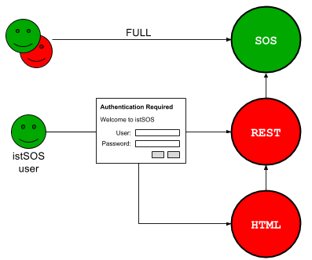

.. _security:

=====================
Security
=====================

Starting from version 2.3, istSOS integrates an authentication & authorization system.

In the next sections you will find more information on how to configure the system 
to protect your istSOS service with an HTTP Basic Authentication.

In istSOS there are four roles: admin, network manager, data manager 
and viewer.

  * **admin**: users with admin role have access to all the istSOS features
  
  * **networkmanager**: The network manager has the permissions to modify everything 
    in the domain of one or more predefined :doc:`istSOS service instance <services>`. He can't create new
    instances and change default istSOS configurations
  
  * **datamanager**: can modify measures, update rating discharge parameters and 
    change procedures metadata
  
  * **visitor**: can view measures

To activate athentication there are a few changes to be made in an Apache Web Server 
configuration file (/etc/apache2/sites-enabled/000-default.conf).

To protect istSOS, the wsgi AuthBasicProvider shall be enabled. 

.. note::

  If not created a default user with username (=admin) and password (=istsos) will be created. Don't forget to change the 
  password for your admin user (see "`Managing users`_" section for details).

---------------------
Use cases
---------------------

istSOS exposes three access points:

+------------------------+-------------+
| Path                   | Type        |
+========================+=============+
| /istsos/{service_name} | SOS server  |
+------------------------+-------------+
| /istsos/wa             | REST API    |
+------------------------+-------------+
| /istsos/{admin|modules}| HTML Files  |
+------------------------+-------------+

* The "**SOS server**" exposes the istSOS lib, which means that this is the place
  where you request information in the Sensor Observation Service way.

* The "**REST API**" exposes the WAlib REST interface, the place where you can do
  easily all the advanced administration requests.

* The "**HTML Files**" is just the place where all the HTML, CSS, JavaScript, Images, etc.
  files are stored and used by the Web Administration and Modules Interfaces.

There are various levels of protection based on different needs. In the next paragraphs
we will introduce 4 use cases you can choose from to protect you istSOS server.
Of course if you are familiar with Apache authentication functionality, you can 
configure istSOS to more specific cases.

^^^^^^^^^^^^^^^^^^^^^^^^^^^^
1. Fully Open
^^^^^^^^^^^^^^^^^^^^^^^^^^^^

This case is the simpliest and that's the way istSOS is installed by default.
No protection is applied, everything is open.

.. warning::

  Be careful! Leaving your istSOS open on the web will permit everyone to
  play with your database, and moreover will permit the creatiion of Virtual 
  Procedures. This exposes your server to threats of malicious code injection. 
  So use this configuration only in truly trusted networks.

.. image:: images/security-open.png

Here an example on how to configure the file (/etc/apache2/sites-enabled/000-default.conf):

.. code-block:: apacheconf

    <VirtualHost *:80>
    
        ServerName istsos.org

        ServerAdmin webmaster@localhost
        DocumentRoot /var/www/html

        ErrorLog ${APACHE_LOG_DIR}/error.log
        CustomLog ${APACHE_LOG_DIR}/access.log combined

        WSGIScriptAlias /istsos /usr/local/istsos/application.py
        Alias /istsos/admin /usr/local/istsos/interface/admin
        Alias /istsos/modules /usr/local/istsos/interface/modules
        
        <LocationMatch /istsos>
            Options +Indexes +FollowSymLinks +MultiViews
            AllowOverride all
            Require all granted
        </LocationMatch>
      
    </VirtualHost> 

^^^^^^^^^^^^^^^^^^
2.1 Closed
^^^^^^^^^^^^^^^^^^

The closed mode block all unauthenticated requests to istSOS lib, WAlib and the HTML files. 

.. image:: images/security-closed-full.png

Here an example on how to configure the file (/etc/apache2/sites-enabled/000-default.conf):

.. code-block:: apacheconf

    <VirtualHost *:80>
    
        ServerName istsos.org

        ServerAdmin webmaster@localhost
        DocumentRoot /var/www/html

        ErrorLog ${APACHE_LOG_DIR}/error.log
        CustomLog ${APACHE_LOG_DIR}/access.log combined

        WSGIScriptAlias /istsos /usr/local/istsos/application.py
        Alias /istsos/admin /usr/local/istsos/interface/admin
        Alias /istsos/modules /usr/local/istsos/interface/modules
        
        <Location /istsos>
            AuthType Basic
            AuthName "Welcome to istSOS"
            AuthBasicProvider wsgi
            WSGIPassAuthorization On
            WSGIAuthUserScript /usr/local/istsos/auth.py
            Require valid-user
            
        </Location>
      
    </VirtualHost> 
    
    
^^^^^^^^^^^^^^^^^^^^^^^^^^^^^^^^^^^^^^^^^^
2.2 Closed, with welcome page open
^^^^^^^^^^^^^^^^^^^^^^^^^^^^^^^^^^^^^^^^^^

The closed mode block all unauthenticated requests to istSOS lib and WAlib. 
The HTML part remains open showing the welcome page with few informations.

.. image:: images/security-closed.png

Here an example on how to configure the file (/etc/apache2/sites-enabled/000-default.conf):

.. note::

  A default username (=admin) and password (=istsos) will be created. Don't forget to change the 
  password for your admin user (see the "Managing users" section).
  
.. code-block:: apacheconf

    <VirtualHost *:80>
    
        ServerName istsos.org

        ServerAdmin webmaster@localhost
        DocumentRoot /var/www/html

        ErrorLog ${APACHE_LOG_DIR}/error.log
        CustomLog ${APACHE_LOG_DIR}/access.log combined

        WSGIScriptAlias /istsos /usr/local/istsos/application.py
        Alias /istsos/admin /usr/local/istsos/interface/admin
        Alias /istsos/modules /usr/local/istsos/interface/modules
        
        <Location /istsos>
            
            SetEnvIf Request_URI "/istsos/admin" noauth=1

            AuthType Basic
            AuthName "Welcome to istSOS"
            AuthBasicProvider wsgi
            WSGIPassAuthorization On
            WSGIAuthUserScript /usr/local/istsos/auth.py
	
            <RequireAny>
                Require env noauth
                Require valid-user
            </RequireAny>
            
        </Location>
      
    </VirtualHost> 
    
^^^^^^^^^^^
3.1 Hybrid
^^^^^^^^^^^

The Hybrid mode blocks all unauthicated interaction with the HTML and the WaLib (REST API),
but opens completely the access to the istSOS lib api (Sensor Observation Service).

.. note::

  With Hybrid mode, unauthicated user will be able to register new sensors and send data 
  using InsertObservation and RegisterSensor POST requests.

  

Here an example on how to configure the file (/etc/apache2/sites-enabled/000-default.conf):

.. note::

  A default username (=admin) and password (=istsos) will be created. Don't forget to change the 
  password for your admin user (see the "Managing users" section).

.. code-block:: apacheconf

    <VirtualHost *:80>
    
        ServerName istsos.org

        ServerAdmin webmaster@localhost
        DocumentRoot /var/www/html

        ErrorLog ${APACHE_LOG_DIR}/error.log
        CustomLog ${APACHE_LOG_DIR}/access.log combined

        WSGIScriptAlias /istsos /usr/local/istsos/application.py
        Alias /istsos/admin /usr/local/istsos/interface/admin
        Alias /istsos/modules /usr/local/istsos/interface/modules
        
        <Location /istsos>
            
            # The name of the service to leave open
            SetEnvIf Request_URI "/istsos/demo" noauth=1

            AuthType Basic
            AuthName "Welcome to istSOS"
            AuthBasicProvider wsgi
            WSGIPassAuthorization On
            WSGIAuthUserScript /usr/local/istsos/auth.py
	
            <RequireAny>
                Require env noauth
                Require valid-user
            </RequireAny>
            
        </Location>
      
    </VirtualHost> 
  

^^^^^^^^^^^^^^^^^^^^^^^^^^^^^^^^^^^^^^^^^^^^^^^^^^^
3.2 Hybrid w/o InsertObservation and RegisterSensor
^^^^^^^^^^^^^^^^^^^^^^^^^^^^^^^^^^^^^^^^^^^^^^^^^^^

The Hybrid mode without InsertObservation and RegisterSensor inhibit the ability
for unauthenticated users to register new sensors and send observation. All the 
other Sensor Observation Sensor requests remains publicly open.

.. image:: images/security-advanced-hybrid.png

To enable this advanced mode you have to configure your /etc/apache2/sites-enabled/000-default.conf 
file like in the simple mode, but you have also to change the /usl/local/istsos/config.py.

Search for the variable **hybrid** and set it to True.

.. code-block:: python

    hybrid = True

Here an example on how to configure the file (/etc/apache2/sites-enabled/000-default.conf). 

.. code-block:: apacheconf

    <VirtualHost *:80>
    
        ServerName istsos.org

        ServerAdmin webmaster@localhost
        DocumentRoot /var/www/html

        ErrorLog ${APACHE_LOG_DIR}/error.log
        CustomLog ${APACHE_LOG_DIR}/access.log combined

        WSGIScriptAlias /istsos /usr/local/istsos/application.py
        Alias /istsos/admin /usr/local/istsos/interface/admin
        Alias /istsos/modules /usr/local/istsos/interface/modules
        
        <Location /istsos>
            
            # The name of the service to leave open
            SetEnvIf Request_URI "/istsos/demo" noauth=1

            AuthType Basic
            AuthName "Welcome to istSOS"
            AuthBasicProvider wsgi
            WSGIPassAuthorization On
            WSGIAuthUserScript /usr/local/istsos/auth.py
	
            <RequireAny>
                Require env noauth
                Require valid-user
            </RequireAny>
            
        </Location>
      
    </VirtualHost> 

---------------------
Managing users
---------------------

To manage users in the script folder you will find a Python script (users.py) that will permit you 
to create, modify and delete istSOS users.

Existing roles:

  * **admin**: users with admin role have access to all the istSOS features
  
  * **datamanager**: can modify measures and change procedures metadata
  
  * **visitor**: can view measures

First open a terminal and go to the istsos folder:

.. code-block:: guess

  cd /user/local/istsos
  
Check the script, ask for the help message:
  
.. code-block:: guess

  python scripts/user.py -h
  
^^^^^^^^^^^^^^^^^^^
List existing users
^^^^^^^^^^^^^^^^^^^

To list registered users, execute:

.. code-block:: bash

  python scripts/user.py -l

.. code-block:: json

  {   "admin": {   "password": "02ee22de9b071a7b0da3b6d732534ab5",
                   "roles": {   "admin": {   "*": ["*"]}}},
      "foobar": {  "password": "02ee22de9b071a7b0da3b6d732534ab5",
                   "roles": {   "datamager": {   "demo": "*"}}}}

.. note::

  Passwords are stored in a clear text file with md5 encryption algorithm

^^^^^^^^^^^^^^^
Creating users
^^^^^^^^^^^^^^^

To create a new user, execute:

.. code-block:: bash

  python scripts/user.py -user foobar -password 1234 -role datamager
  
You can limit access to an instance adding the service name

.. code-block:: bash

  python scripts/user.py -user foo -password bar -role datamager -s demo
  
Add access to a service to an existing user

.. code-block:: bash

  python scripts/user.py -user foo -role datamager -s otherservice

^^^^^^^^^^^^^^^^^^^^^
Modify users password
^^^^^^^^^^^^^^^^^^^^^

To modify existing users, execute:

.. code-block:: bash

  python scripts/user.py -user admin -password batman
  
^^^^^^^^^^^^^
Delete a user
^^^^^^^^^^^^^

To delete a user, execute:

.. code-block:: bash

  python scripts/user.py -r -user foo
  
  

