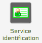
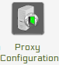

.. _services:

============================
Creation of istSOS services
============================

--------------------------------------
Setting up an istSOS service instance
--------------------------------------
With istSOS you can organize your sensor data in different instances. Every instance has its own database schema independent from other instances. You can even deploy other databases over your network according to your needs. 

The first steps into istSOS setup is to configure the default configuration options. These options will then be automatically used for your convenience by every new istSOS instance created. 

**1) Open the Web Admin interface** 

Open a browser and go to `<http://localhost/istsos/admin>`_ 

For each of the next steps the image represents the button to select for activating the panel to execute the operation.

**2) Configure your database connection**

.. image::  images/db.png

From the toolbar buttons menu press the database button and fill in the database configuration options:

::

    user: postgres
    password: postgres
    host: localhost
    port: 5432
    DB name: istsos
    
**3) Configure the default Service provider information**

.. image::  images/provider.png

Use your instiutional information.

**4) Configure the default Service identification information**

Fill up with custom metadata that describe the service usage.

**5) Configure your service coordinates system**

.. image:: images/coord-systems.png

*Default EPSG code*: this will be the native Coordinate Reference Systems of your geometries in the database.

*Permitted EPSG*: here you can configure which other Coordinate Reference Systems your system will support and reproject if requested.

**6) Configure your getobservation request options**

.. image:: images/getobs.png

Set maximum time interval per getObservation requests (zero for no limits) and aggregation no-data value.

**7) Configure your service proxy address**

The Proxy URL field is the base URL seen beyond a reverse proxy.

