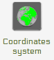
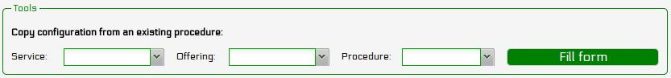

.. _tutorial:

======================
Tutorial: using istSOS
======================

------------------------------
Installation and Requirements
------------------------------

* Install PostgreSQL

::
    
    sudo apt-get install postgresql postgresql-client postgresql-contrib pgadmin3
    
* Install PostGIS

::
    
    sudo apt-get install postgresql-9.1-postgis
    
    
* Configure PostgreSQL password

::

    sudo -u postgres psql
    alter user postgres password 'postgres';
    
* Install Apache2 

::
    
    sudo apt-get install apache2

* Install mod_wsgi

::
    
    sudo apt-get install libapache2-mod-wsgi

* Install psycopg2

::
    
    sudo apt-get install python-psycopg2

* Download istSOS and unpack it in */usr/local/istsos*

::
    
    wget http://istsos.googlecode.com/files/istSOS-2.0.tar.gz
    sudo tar -zxvf istSOS-2.0.tar.gz  -C /usr/local/
    
* Set executing permission and owner for the folders services and logs

::
    
    sudo chmod 755 -R /usr/local/istsos
    sudo chown -R www-data:www-data /usr/local/istsos/services
    sudo chown -R www-data:www-data /usr/local/istsos/logs

* Configure Apache and WSGI

Open /etc/apache2/sites-enabled/000-default and add the following lines
just before the tag </VirtualHost>

::
    
    WSGIScriptAlias /istsos /usr/local/istsos/application.py
    Alias /istsos/admin /usr/local/istsos/interface

* restart apache2 server

::

    sudo /etc/init.d/apache2 restart     
 

* check the installation success on the browser loading the page *http://localhost/istsos/admin*

::

    http://localhost/istsos/admin     

You shoud see the server status page:

.. figure::  images/interface-server-status-1.png
   :align:   center
   :scale:   100
   

* create your PostGIS database

::

   sudo -u postgres createdb -E UTF8 istsos
   sudo -u postgres psql -d istsos -f /usr/share/postgresql/9.1/contrib/postgis-1.5/postgis.sql
   sudo -u postgres psql -d istsos -f /usr/share/postgresql/9.1/contrib/postgis-1.5/spatial_ref_sys.sql
   

----------------------------
Configure your server
----------------------------
* configure your server with GUI-WA. Press the database button.

.. image::  images/interface-buttons-database.png

::

    Server > Database
    
        user: postgres
        password: postgres
        host: localhost
        port: 5432
        DB name: istsos
        
      
* configure your service provider informations.

.. image::  images/interface-buttons-service-provider.png
  
::

    Server > Service provider
    
        use your institutional information

* configure your service identification informations.

.. image::  images/interface-buttons-service-identification.png

::

    Server > Service identification
    
        describe the service with metadata

* configure your service coordinates system.

::

    Server > Coordinates system
    
        set your default EPSG code, other permitted coord. systems, name of the axis

* configure your getobservation request options

.. image::  images/interface-buttons-getobservation.png

::

    Server > GetObservation configuration
    
        set maximum interval per request and no data aggregation value
 
* configure your service proxy address

.. image::  images/interface-buttons-proxy.png

::

    Server > Proxy configuration
    
        set the address of the istsos service
 

----------------------------
Create a new service
----------------------------
* Create a new service

.. image::  images/interface-buttons-new-service.png

::

    Server > New service
    
        set the service name (*demo*) and optionally EPSG and database connections 
 

* Check GUI

.. image::  images/interface-buttons-status.png

::

    Server > Status
    
        verify that database is active and Availability is up

* Check the service with GetCapabilities

::

    http://localhost/istsos/demo?request=GetCapabilities&version=1.0.0&service=SOS
    
* Configure according your preference

.. note:: remember that the server configurations are set by default

----------------------------
Add new sensors
----------------------------

* Define the observed properties (your service onthologies)

.. image::  images/interface-buttons-observed-properties.png

::
    
    services > demo > Observed properties
    
        Name: air-temperature
        Definition URN: urn:ogc:def:parameter:x-istsos:1.0:meteo:air:temperature
        Description: air temperature at 2 meters above terrain

        Name: air-rainfall
        Definition URN: urn:ogc:def:parameter:x-istsos:1.0:meteo:air:rainfall
        Description: liquid precipitation or snow water equivalent

        Name: air-relative-humidity
        Definition URN: urn:ogc:def:parameter:x-istsos:1.0:meteo:air:humidity:relative
        Description: absolute humidity relative to the maximum for that air pressure and temperature

        Name: air-wind-velocity
        Definition URN: urn:ogc:def:parameter:x-istsos:1.0:meteo:air:wind:velocity
        Description: wind speed at 10 meters above terrain

* Define the units of measure

.. image::  images/interface-buttons-uoms.png

::
    
    services > demo > Unit of measures
    
        Code: mm
        Description: millimiter
        
        Code: °C
        Description: Celsius degree
        
        Code: %
        Description: percentage
        
        Code: m/s
        Description: metre per second
        
* Add a new procedure

.. image::  images/interface-buttons-new-procedure.png

::

   services > demo > New procedure
    
        Name: T_LUGANO
        Description: temperature weather station in Lugano
        Keywords: weather, meteorological, IST
        
        System type: insitu-fixed-point
        Sensor type: PTC thermistors of the "switching" type
        
        FOI name: LUGANO
        EPSG: 4326
        Coordinates: x: 8.96127 y: 46.02723 z: 344.1
        
        Outputs:
            Observed property: urn:ogc:def:parameter:x-istsos:1.0:meteo:air:temperature
            Unit od measure: °C
            Description: conversion from resistance to temperature
            quality index check: Between / from -40 to +60
            
            Confirm the outputs pressing the "add" button.
        
        Optional parameters:
            fill at your own need and willing
            
        Register the new sensor (procedure) pressing the "submit" button.
  
* Add other procedures

.. image::  images/interface-buttons-new-procedure.png

.. note:: look at the tool for "copy configuration from existing procedure"

::

   services > demo > New procedure
    
        Name: P_LUGANO
        Description: rainfall weather station in Lugano
        Keywords: weather, meteorological, IST
        
        System type: insitu-fixed-point
        Sensor type: tipping bucket rain gauge
        
        FOI name: LUGANO
        EPSG: 4326
        Coordinates: x: 8.96127 y: 46.02723 z: 344.1
        
        Outputs:
            Observed property: urn:ogc:def:parameter:x-istsos:1.0:meteo:air:rainfall
            Unit od measure: mm
            Description: -
            quality index check: Between / from 0 to +500
        
        Optional parameters:
            fill at your own need and willing

::

   services > demo > New procedure
    
        Name: LOCARNO
        Description: temperature and rainfall weather station in Locarno
        Keywords: weather, meteorological, IST
        
        System type: insitu-fixed-point
        Sensor type: Davis weather station
        
        FOI name: LOCARNO
        EPSG: 4326
        Coordinates: x: 8.79212 y: 46.15515 z: 197.8
        
        Outputs:
            Observed property: urn:ogc:def:parameter:x-istsos:1.0:meteo:air:rainfall
            Unit od measure: mm
            Description: -
            quality index check: Between / from 0 to +500
        
            Observed property: urn:ogc:def:parameter:x-istsos:1.0:meteo:air:temperature
            Unit od measure: °C
            Description: conversion from resistance to temperature
            quality index check: Between / from -40 to +60
        
        Optional parameters:
            fill at your own need and willing

::

    services > demo > New procedure
    
        Name: BELLINZONA
        Description: weather station in Bellinzona
        Keywords: weather, meteorological, IST
        
        System type: insitu-fixed-point
        Sensor type: Davis weather station
        
        FOI name: BELLINZONA
        EPSG: 4326
        Coordinates: x: 9.01976 y: 46.20322 z: 226.3
        
        Outputs:
            Observed property: urn:ogc:def:parameter:x-istsos:1.0:meteo:air:rainfall
            Unit od measure: mm
            Description: -
            quality index check: from 0 to +500
        
            Observed property: urn:ogc:def:parameter:x-istsos:1.0:meteo:air:temperature
            Unit od measure: °C
            Description: conversion from resistance to temperature
            quality index check: Between / from -40 to +60
            
            Observed property: urn:ogc:def:parameter:x-istsos:1.0:meteo:air:humidity:relative
            Unit od measure: %
            Description: -
            quality index check: Between / from 0 to 100
        
            Observed property: urn:ogc:def:parameter:x-istsos:1.0:meteo:air:wind:velocity
            Unit od measure: m/s
            Description: -
            quality index check: Between / from 0 to 200
        
        Optional parameters:
            fill at your own need and willing  

* Check your Sensors

::

    services > demo > Procedures
    
    it provides you a table with sensors and relative offerings and observedProperties

----------------------------
Create Offerings
----------------------------
* Create a new offering

::

    services > demo > Offering editor
        
        Name: workshop
        Description: demo dataset for GRASS meeting
        Expiration: 2013-02-28T00:00:00+01:00
        Validity: Enabled
    
    Offering-procedure memberships: add all of the procedures
    
* Check your Sensors

::

    services > demo > Procedures
    
    it provides you a table with sensors and relative offerings and observedProperties

----------------------------
Load/insert observations
----------------------------

* Prepare data

    Fot this part of the tutorial you should use ASCII files with sensor data formatted according to *istSOS-ASCII-format*. This format is a CSV with an header as first line containing the URI names of the observed properties, the following lines contains the data.

:: 

    urn:ogc:def:parameter:x-istsos:1.0:time:iso8601,urn:ogc:def:parameter:x-istsos:1.0:meteo:air:temperature
    2013-01-01T00:10:00.000000+0100,0.446000
    2013-01-01T00:20:00.000000+0100,0.862000
    2013-01-01T00:30:00.000000+0100,0.932000
    2013-01-01T00:40:00.000000+0100,0.384000

Download sensor datasets:

-  :download:`BELLINZONA.DAT <tutorial/dataset/BELLINZONA.DAT>`
-  :download:`LOCARNO.DAT <tutorial/dataset/LOCARNO.DAT>`
-  :download:`P_LUGANO.DAT <tutorial/dataset/P_LUGANO.DAT>`
-  :download:`T_LUGANO.DAT <tutorial/dataset/T_LUGANO.DAT>`

* Load using cmdimportcsv.py script

::

    cd /usr/local/istsos
    python cmdimportcsv.py --h
    python cmdimportcsv.py -s demo -u http://localhost/istsos -p T_LUGANO -w /home/user/Download
    python cmdimportcsv.py -s demo -u http://localhost/istsos -p P_LUGANO -w /home/user/Download
    python cmdimportcsv.py -s demo -u http://localhost/istsos -p LOCARNO -w /home/user/Download
    python cmdimportcsv.py -s demo -u http://localhost/istsos -p BELLINZONA -w /home/user/Download

* Check on the GUI

::

    Data viewer > Data Editor
    
    it provides you with interface for viewing data

----------------------------
Advance users
----------------------------

* Let's use the XML `examples <examples.html>`_

* Let's edit the data using the calculator

